# Sprites list
| Sprite | Icon |
|--------|------|
|1-nce-member||
|100tb||
|3-k-technologies-kcsp|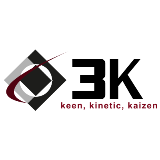|
|3-k-technologies-member|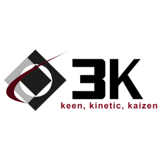|
|3-scale|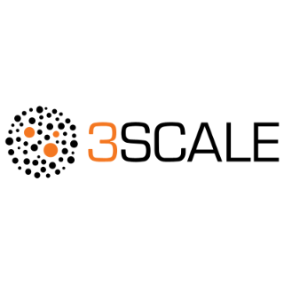|
|3-shake-kcsp||
|3-shake-member|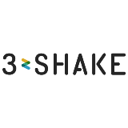|
|500px||
|5e2aaaf0e8da5a419c2239f1_jmeter_square|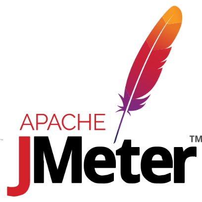|
|87_amazon-eks.bfd50c55e9||
|88_amazon-eks-icon.707110b6d1||
|99-cloud-kcsp||
|99-cloud-ktp||
|99cloud-member||
|Arch_Amazon-Elastic-Container-Service_64||
|a10-networks-member||
|aarch64-original||
|aarch64-plain||
|acc-ict-kcsp||
|acc-ict-member||
|accenture-kcsp|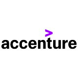|
|accenture-member||
|accu-knox-member||
|accurics-member||
|acend-kcsp||
|acend-member||
|acnodal-member||
|acornsoft-kcsp||
|acornsoft-ktp||
|active-campaign-icon||
|active-campaign||
|active-directory_large||
|activemq_large||
|adfolks-kcsp||
|adfolks-member||
|adidas-supporter||
|adobe-launch||
|adobe-login-brand-mark||
|adobe_large||
|adonisjs-icon||
|adonisjs-original-wordmark||
|adonisjs-original||
|adonisjs||
|adroll||
|adyen||
|aeolabs-member|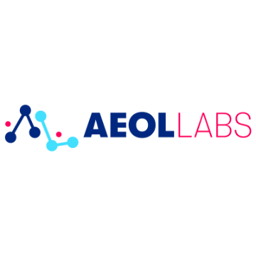|
|aerospike-icon||
|aerospike-member||
|aerospike|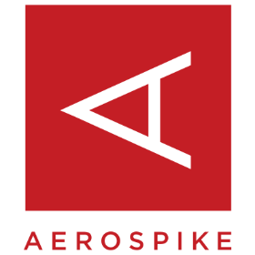|
|aerospike_large||
|afi-technologies-member||
|aftereffects-original||
|aftereffects-plain||
|agentil-software-sap-businessobjects_large||
|agentil-software-sap-netweaver_large||
|agola||
|agora-kube||
|agree-technology-member||
|agyla-member||
|airbnb-supporter||
|airbnb||
|airbrake||
|airbrake_large||
|airflow||
|airflow_large||
|airship||
|airtable||
|aiven-member|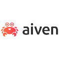|
|akamai-datastream_large||
|akamai-mpulse_large||
|akamai||
|akamai_2||
|akamai_3||
|akana||
|akatsuki-member||
|akka||
|akka_2|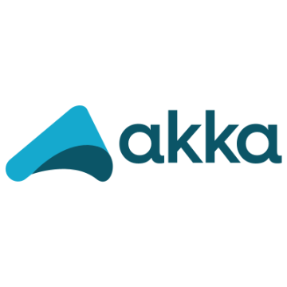|
|aks-engine-for-azure-stack||
|alauda-cloud-enterprise-ace||
|alauda-container-platform-acp||
|alauda-kcsp||
|alauda-ktp||
|alauda-member||
|alauda||
|alcide-member|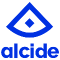|
|alcide|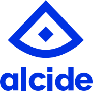|
|alcide_large||
|alerant-kcsp||
|alerant-member||
|alfresco||
|algolia||
|algorithmia||
|algorithmia_large||
|alibaba-cloud-container-registry-acr||
|alibaba-cloud-container-service-for-kubernetes||
|alibaba-cloud-file-storage-cpfs||
|alibaba-cloud-file-storage||
|alibaba-cloud-function-compute|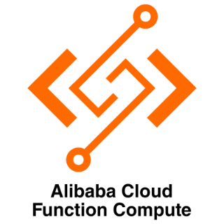|
|alibaba-cloud-kcsp||
|alibaba-cloud-log-service||
|alibaba-cloud-member||
|alibaba-cloud-serverless-app-engine|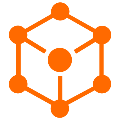|
|alibaba-cloud-serverless-workflow|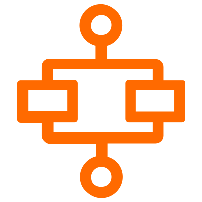|
|alibaba-cloud||
|alibaba-cloud_large||
|all-cloud-member||
|allianz-direct-member||
|alluxio||
|alpinejs-icon||
|alpinejs||
|altair|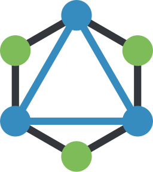|
|alter-way-kcsp|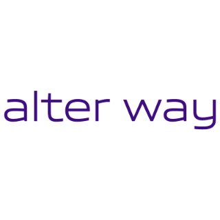|
|alter-way-ktp||
|alter-way-member||
|altinity-member||
|altoros-kcsp||
|altoros-ktp|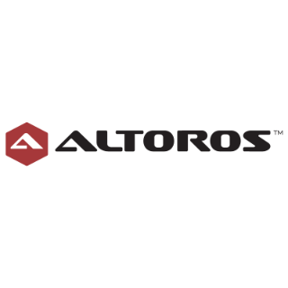|
|altoros-member||
|altostra_large||
|amadeus-supporter||
|amazon-api-gateway_large||
|amazon-app-mesh_large||
|amazon-app-runner_large|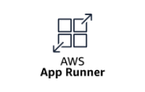|
|amazon-appstream_large||
|amazon-appsync_large||
|amazon-athena_large||
|amazon-auto-scaling_large|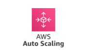|
|amazon-backup_large||
|amazon-billing_large||
|amazon-certificate-manager_large||
|amazon-chime|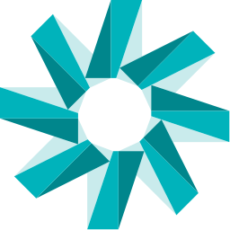|
|amazon-cloud-watch||
|amazon-cloudfront_large||
|amazon-cloudhsm_large||
|amazon-cloudsearch_large||
|amazon-cloudtrail_large||
|amazon-codebuild_large||
|amazon-codedeploy_large||
|amazon-cognito_large||
|amazon-connect||
|amazon-connect_large||
|amazon-direct-connect_large||
|amazon-dms_large||
|amazon-documentdb||
|amazon-documentdb_large||
|amazon-dynamodb-logo|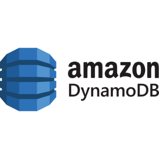|
|amazon-dynamodb_large||
|amazon-ebs_large||
|amazon-ec2-spot_large||
|amazon-ec2_large||
|amazon-ecr||
|amazon-ecs||
|amazon-ecs_large||
|amazon-ecs_large_3||
|amazon-ecs_large_4||
|amazon-efs_large||
|amazon-eks-on-fargate_large||
|amazon-eks-stacked||
|amazon-eks-working||
|amazon-eks||
|amazon-eks_3||
|amazon-eks_large||
|amazon-elastic-beanstalk_large||
|amazon-elastic-block-store-ebs|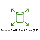|
|amazon-elastic-container-registry-ecr||
|amazon-elastic-container-service-ecs|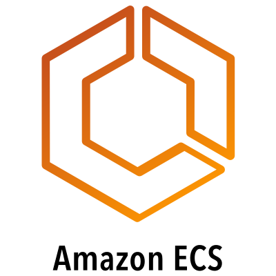|
|amazon-elastic-container-service-for-kubernetes-eks||
|amazon-elastic-kubernetes-service-distro-amazon-eks-d||
|amazon-elastic-transcoder_large||
|amazon-elasticache_large||
|amazon-elb_large||
|amazon-emr_large||
|amazon-es_large||
|amazon-event-bridge_large||
|amazon-firehose_large||
|amazon-fsx_large||
|amazon-gamelift_large||
|amazon-glue_large||
|amazon-guardduty_large||
|amazon-health_large||
|amazon-inspector_large||
|amazon-iot_large||
|amazon-kafka_large||
|amazon-keyspaces_large||
|amazon-kinesis-data-analytics_large||
|amazon-kinesis||
|amazon-kinesis_large||
|amazon-kms_large||
|amazon-lambda_large||
|amazon-lex_large||
|amazon-machine-learning_large||
|amazon-mediaconnect_large||
|amazon-mediaconvert_large||
|amazon-mediapackage_large||
|amazon-mediatailor_large||
|amazon-mq_large||
|amazon-msk_large||
|amazon-nat-gateway_large||
|amazon-neptune_large||
|amazon-network-firewall_large||
|amazon-opsworks_large||
|amazon-polly_large||
|amazon-rds-proxy_large||
|amazon-rds_large||
|amazon-redshift-logo||
|amazon-redshift_large||
|amazon-rekognition_large||
|amazon-route-53_large||
|amazon-s3-storage-lens_large||
|amazon-s3||
|amazon-s3_large||
|amazon-sagemaker_large||
|amazon-security-hub_large||
|amazon-ses_large||
|amazon-shield_large||
|amazon-sns_large||
|amazon-sqs_large||
|amazon-step-functions_large|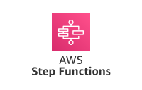|
|amazon-storage-gateway_large||
|amazon-swf_large||
|amazon-translate_large||
|amazon-trusted-advisor_large||
|amazon-vpc_large||
|amazon-vpn_large||
|amazon-waf_large||
|amazon-web-services-member||
|amazon-web-services_large||
|amazon-workspaces_large||
|amazon-xray_large||
|amazonwebservices-original-wordmark||
|amazonwebservices-original||
|amazonwebservices-plain-wordmark||
|ambari_large||
|ambassador-member||
|ambassador_large||
|amex||
|amihan-kcsp|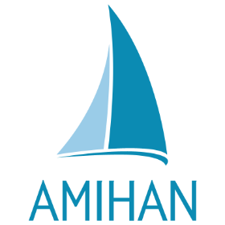|
|amihan-member||
|amixr_large||
|amp-icon||
|amp||
|ampere-consulting-member|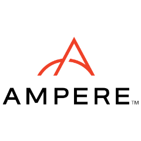|
|ampersand||
|amplitude-icon||
|amplitude||
|anchnet-kcsp|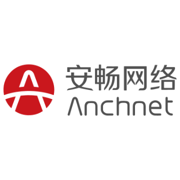|
|anchnet-member|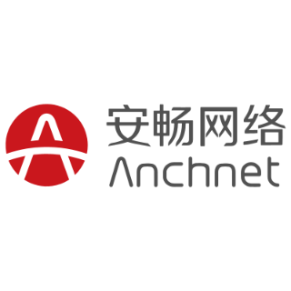|
|anchore-member||
|anchore||
|android-icon||
|android-original-wordmark||
|android-original||
|android-plain-wordmark||
|android-plain||
|android||
|angellist||
|angular-icon||
|angular||
|angularjs-original-wordmark||
|angularjs-original||
|angularjs-plain-wordmark||
|angularjs-plain||
|anova-supporter||
|ansible||
|ansible_2|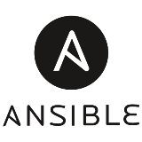|
|ansible_3|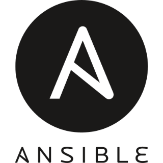|
|ansible_large|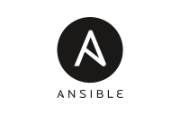|
|ant-design||
|ant-financial-member||
|antrea|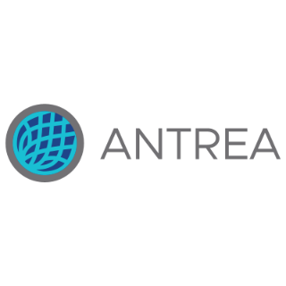|
|anynines-member||
|apache-apisix_large||
|apache-camel-k||
|apache-camel||
|apache-carbon-data|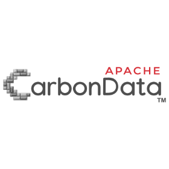|
|apache-hadoop|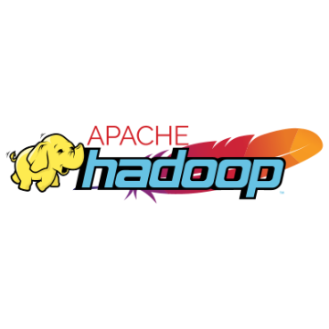|
|apache-hbase-logo|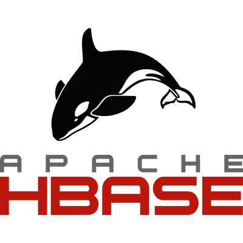|
|apache-heron|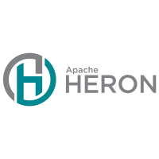|
|apache-ignite||
|apache-jmeter||
|apache-line-wordmark||
|apache-line|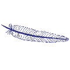|
|apache-mesos-logo-vertical|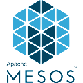|
|apache-mesos||
|apache-ni-fi||
|apache-nifi-logo||
|apache-open-whisk|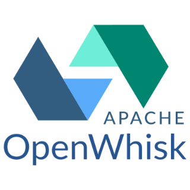|
|apache-plain-wordmark||
|apache-plain|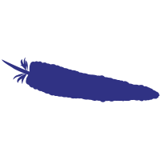|
|apache-rocket-mq||
|apache-spark||
|apache-storm||
|apache-thrift||
|apache-zookeeper|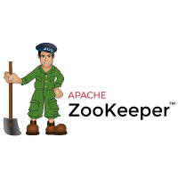|
|apache||
|apache_cloudstack||
|apache_large||
|apachekafka-original-wordmark||
|apachekafka-original|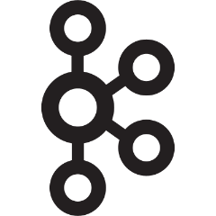|
|ape-factory-member||
|apiary||
|apigee_large||
|apiiro-member||
|apioak||
|apisix||
|apolicy-member||
|apolicy||
|apollo||
|apollo_large||
|apollostack||
|apostrophe|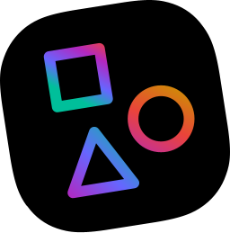|
|app-dynamics||
|app-neta||
|app-optics||
|app-scale|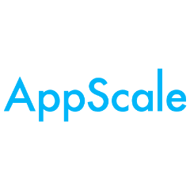|
|appbaseio-icon|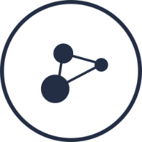|
|appbaseio||
|appcelerator-original-wordmark|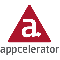|
|appcelerator-original|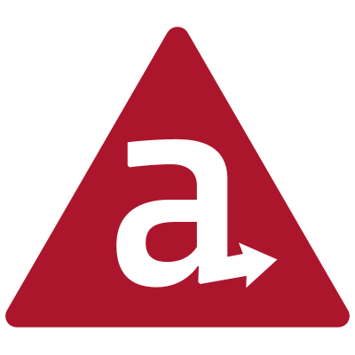|
|appcelerator-plain-wordmark||
|appcircle-icon||
|appcircle||
|appcode||
|appddiction-studio-kcsp||
|appddiction-studio-ktp||
|appddiction-studio-member|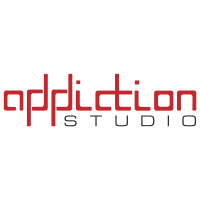|
|appdynamics||
|appium||
|appium_3||
|appkeeper_large||
|apple-app-store||
|apple-member||
|apple-original||
|apple-pay||
|apple||
|application-high-availability-service||
|applications-manager||
|appsignal-icon|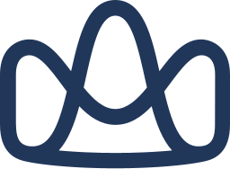|
|appsignal||
|apptentive||
|appveyor||
|appveyor_2||
|appvia-kcsp||
|appvia-member||
|appwrite-original-wordmark||
|appwrite-original||
|appwrite-plain-wordmark||
|appwrite-plain||
|aqua-security-kcsp||
|aqua-security-member||
|aqua||
|aqua_large||
|arango-db-member||
|arango-db||
|arangodb||
|architect||
|archlinux||
|arctiq-kcsp||
|arctiq-member||
|arduino-original-wordmark||
|arduino-original||
|arduino-plain-wordmark||
|arduino-plain||
|arduino||
|argo-icon||
|argo||
|argo_2||
|argon-member||
|argoprojio-full||
|argyle-systems-supporter||
|arima-member||
|arista-networks-member||
|arm-member||
|arm-treasure-data-kcsp||
|armo-member||
|armo||
|armory-member||
|armory||
|armory_2||
|arrikto-member||
|arrikto||
|artifact-hub||
|asana||
|asciidoctor||
|asia-info-member||
|aspdotnet_large||
|aspecto-member||
|aspecto||
|aspen-mesh-kcsp||
|aspen-mesh-member||
|astro||
|astronomer||
|asus-cloud-corporation-member||
|asus-cloud-infra||
|at-t-member||
|aternity||
|atix-kcsp||
|atix-member||
|atlassian-member||
|atlassian||
|atom-icon||
|atom-original-wordmark||
|atom-original||
|atom||
|atomic-icon||
|atomic||
|atomist||
|audi-supporter||
|audit-board-supporter||
|aurelia||
|aurora||
|auth-keys-supporter||
|auth0-icon||
|auth0||
|auth0_large||
|authy||
|autodesk-member||
|autoit||
|autoprefixer||
|ava||
|avi-networks||
|avi-vantage_large||
|aviatrix||
|avro||
|awesome||
|aws-amplify||
|aws-api-gateway||
|aws-app-mesh||
|aws-appflow||
|aws-appsync||
|aws-artifact||
|aws-athena||
|aws-aurora||
|aws-backup||
|aws-batch||
|aws-cdk||
|aws-certificate-manager||
|aws-cloud-formation||
|aws-cloud-map||
|aws-cloudformation-logo||
|aws-cloudformation||
|aws-cloudformation_2||
|aws-cloudfront||
|aws-cloudsearch||
|aws-cloudtrail||
|aws-cloudwatch||
|aws-code-pipeline||
|aws-codebuild||
|aws-codebuild_3||
|aws-codecommit||
|aws-codecommit_3||
|aws-codedeploy||
|aws-codedeploy_3||
|aws-codepipeline||
|aws-codepipeline_3||
|aws-codestar||
|aws-cognito||
|aws-config||
|aws-documentdb||
|aws-dynamodb||
|aws-ec2||
|aws-ecr||
|aws-ecs||
|aws-eks||
|aws-elastic-beanstalk||
|aws-elasticache||
|aws-elasticache_3||
|aws-elb||
|aws-eventbridge||
|aws-fargate||
|aws-fargate_large||
|aws-glacier||
|aws-glue||
|aws-iam||
|aws-keyspaces||
|aws-kinesis||
|aws-kms||
|aws-lake-formation||
|aws-lambda||
|aws-lambda_2||
|aws-lightsail||
|aws-mq||
|aws-msk||
|aws-neptune||
|aws-open-search||
|aws-opsworks||
|aws-pricing_large||
|aws-quicksight||
|aws-rds||
|aws-redshift||
|aws-route53||
|aws-s3||
|aws-secrets-manager||
|aws-server-application-model-sam||
|aws-ses||
|aws-shield||
|aws-sns||
|aws-sqs||
|aws-step-functions||
|aws-systems-manager||
|aws-timestream||
|aws-vpc||
|aws-waf||
|aws-xray||
|aws||
|aws_3||
|axelerant-kcsp||
|axelerant-member||
|axiata-digital-labs-member||
|axios||
|azure-active-directory_large||
|azure-aks-engine||
|azure-analysisservices_large||
|azure-apimanagement_large||
|azure-app-services_large||
|azure-applicationgateway_large||
|azure-appserviceenvironment_large||
|azure-appserviceplan_large||
|azure-automation_large||
|azure-batch_large||
|azure-blob-storage||
|azure-blob-storage_large||
|azure-cognitiveservices_large||
|azure-containerinstances_large||
|azure-containerservice_large||
|azure-cosmos-db-logo||
|azure-cosmosdb_large||
|azure-customerinsights_large||
|azure-data-explorer_large||
|azure-data-lake-logo||
|azure-datafactory_large||
|azure-datalakeanalytics_large||
|azure-datalakestore_large||
|azure-db-for-mysql_large||
|azure-db-for-postgresql_large||
|azure-dbformariadb_large||
|azure-deployment-manager_large||
|azure-devops-logo-vertical||
|azure-diagnostic-extension_large||
|azure-disk-storage||
|azure-event-hub_large||
|azure-event-hubs||
|azure-eventgrid_large||
|azure-expressroute_large||
|azure-filestorage_large||
|azure-firewall_large||
|azure-full||
|azure-functions||
|azure-hdinsight_large||
|azure-iot-edge_large||
|azure-iot-hub_large||
|azure-keyvault_large||
|azure-kubernetes-service-aks||
|azure-load-balancer_large||
|azure-logic-app_large||
|azure-machine-learning-services_large||
|azure-monitor||
|azure-networkinterface_large||
|azure-notificationhubs_large||
|azure-original-wordmark||
|azure-original||
|azure-pipelines||
|azure-plain-wordmark||
|azure-plain||
|azure-publicipaddress_large||
|azure-queue-storage_large||
|azure-redis-cache_large||
|azure-registry||
|azure-relay_large||
|azure-resource-manager-logo||
|azure-search_large||
|azure-service-bus_large||
|azure-service-fabric||
|azure-sql-database_large||
|azure-sql-elastic-pool_large||
|azure-streamanalytics_large||
|azure-table-storage_large||
|azure-usage-and-quotas_large||
|azure-virtual-network_large||
|azure-vm-scale-set_large||
|azure-vm_large||
|azure_functions_large||
|azure_large||
|azuredevops_large||
|b-nova-member||
|babel-original||
|babel-plain||
|babel||
|babylon-health-supporter||
|backbone-icon||
|backbone||
|backbonejs-original-wordmark||
|backbonejs-original||
|backbonejs-plain-wordmark||
|backbonejs-plain||
|backerkit||
|backstage||
|baidu-cloud-container-engine||
|baidu-cloud-function-compute||
|baidu-kcsp||
|baidu-member||
|baker-street||
|balena-member||
|balena||
|bamboo-systems-member||
|bamboo||
|bamboo_2||
|bamboo_3||
|banzai-cloud-kcsp||
|basecamp||
|basekit||
|bash-icon||
|bash-original||
|bash-plain||
|bash||
|bash_2||
|bash_3||
|batch||
|bc-cloud-kcsp||
|bc-cloud-member||
|be-open-it-kcsp||
|be-open-it-ktp||
|be-open-it-member||
|beam||
|beats||
|beats_2||
|behance-original-wordmark||
|behance-original||
|behance-plain-wordmark||
|behance-plain||
|behance||
|bem-2||
|bem||
|benchmark-corporation-member||
|bfe||
|bigchain-db||
|bigpanda-bigpanda_large||
|bigpanda||
|bigpanda_large||
|bind9_large||
|bing||
|biqmind-member||
|bitbucket-original-wordmark||
|bitbucket-original||
|bitbucket||
|bitbucket_large||
|bitcoin||
|bitnami-tanzu-application-catalog||
|bitnami||
|bitrise-icon||
|bitrise||
|bizmicro||
|biznet-gio-member||
|black-duck||
|blameless-member||
|blender||
|blitzjs-icon||
|blitzjs||
|blizzard-member||
|blizzard-supporter||
|blockchain-technology-partners-member||
|blocs||
|blogger||
|bloombase||
|bloomberg-member||
|blossom||
|blue-matador||
|blue-matador_large||
|blue-sentry-kcsp||
|blue-sentry-member||
|blueprint||
|bluetooth||
|bo-cloud-beyond-container||
|bo-cloud-kcsp||
|bo-cloud-member||
|boer-technology-kcsp||
|boer-technology-ktp||
|boer-technology-member||
|bonc-member||
|bonsai_large||
|booqable||
|bootstrap-original||
|bootstrap-plain-wordmark||
|bootstrap-plain||
|bootstrap||
|booz-allen-hamilton-kcsp||
|booz-allen-hamilton-member||
|bosh||
|bosun||
|botanalytics||
|botprise_large||
|bourbon||
|bower-line-wordmark||
|bower-line||
|bower-original-wordmark||
|bower-original||
|bower-plain-wordmark||
|bower-plain||
|bower||
|box-boat-kcsp||
|box-boat-ktp||
|box-supporter||
|box||
|boxboat-member||
|brackets||
|branch||
|brandfolder-icon||
|brandfolder||
|brave||
|braze||
|brickdoc-member||
|bridgecrew-member||
|brigade||
|brobridge-kcsp||
|brobridge-member||
|broccoli||
|brotli||
|browserify-icon||
|browserify||
|browserling||
|browserslist||
|browserstack||
|browsersync||
|brunch||
|btrfs_large||
|buck||
|buddy||
|buddy_large||
|buffer||
|bugherd||
|bugsee||
|bugsnag-icon||
|bugsnag||
|bugsnag_large||
|build-security-member||
|buildkite-icon||
|buildkite||
|buildkite_2||
|bulma-plain||
|bulma||
|buoyant-member||
|c-line||
|c-original||
|c-plain||
|c-plusplus||
|c-sharp||
|c||
|ca-technologies-member||
|cable-labs-member||
|cable-labs-snaps-kubernetes||
|cachet||
|cacti_large||
|cadence-workflow||
|caffe2||
|caicloud-kcsp||
|caicloud-ktp||
|caicloud-member||
|cakephp-icon||
|cakephp-original-wordmark||
|cakephp-original||
|cakephp-plain-wordmark||
|cakephp-plain||
|cakephp||
|calyptia-member||
|cambia-health-solutions-member||
|campaignmonitor-icon||
|campaignmonitor||
|campfire_large||
|camptocamp-kcsp||
|camptocamp-ktp||
|camptocamp-member||
|canada-health-infoway-member||
|canjs||
|canonical-charmed-distribution-of-kubernetes||
|canonical-kcsp||
|canonical-member||
|canva-original||
|capacitorjs-icon||
|capacitorjs||
|cape||
|capistrano||
|capistrano_large||
|capital-one-member||
|capsule8-member||
|capsule8||
|carbide||
|carbonblack_large||
|cars-china-academy-of-railway-sciences-member||
|carvel||
|cassandra||
|cassandra_2||
|cassandra_3||
|cassandra_large||
|cast-ai-member||
|catalyst-cloud-kcsp||
|catalyst-cloud-member||
|catalyst-kubernetes-service||
|catchpoint||
|catchpoint_large||
|caylent-kcsp||
|caylent-member||
|cdk-for-kubernetes-cdk8s||
|cds-capitalonline-data-service-member||
|celonis-supporter||
|cengn-kcsp||
|cengn-member||
|centos-icon||
|centos-original-wordmark||
|centos-original||
|centos-plain-wordmark||
|centos-plain||
|centos||
|centreon||
|ceph||
|ceph_large||
|cert-manager||
|cert-manager_large||
|certbot||
|ceylon-original-wordmark||
|ceylon-original||
|ceylon-plain-wordmark||
|ceylon-plain||
|ceylon||
|cf-engine||
|chai||
|chalice||
|chalk||
|chaos-mesh||
|chaos-toolkit||
|chaosblade||
|chaoskube||
|chargebee-icon||
|chargebee||
|chatwork_large||
|check-point||
|checkmk||
|chef-habitat||
|chef-in-spec||
|chef-infra||
|chef-member||
|chef||
|chef_2||
|chef_3||
|chef_large||
|chevereto||
|china-asean-information-harbor-container-cloud||
|china-asean-information-harbor-kcsp||
|china-asean-information-harbor-member||
|china-mobile-cmit-paa-s||
|china-mobile-kcs||
|china-mobile-kcsp||
|china-mobile-member||
|china-systems-kcsp||
|china-systems-member||
|china-unicom-member||
|chinaunicom-kubernetes-engine||
|chromatic-icon||
|chromatic||
|chrome-original-wordmark||
|chrome-original||
|chrome-plain-wordmark||
|chrome-plain||
|chrome||
|chronosphere-member||
|chronosphere||
|chubao-fs||
|cilium||
|cilium_large||
|cinder||
|cinq-kcsp||
|cinq-member||
|circle-ci-member||
|circle-ci||
|circleci-logo||
|circleci-plain-wordmark||
|circleci-plain||
|circleci||
|circleci_large||
|circonus-logo-full-color-for-light-background||
|circonus||
|cirrus-ci||
|cirrus||
|cisco-aci_large||
|cisco-container-platform||
|cisco-intersight-kubernetes-service||
|cisco-member||
|citi-member||
|citrix-adc-formerly-net-scaler-adc||
|citrix-hypervisor_large||
|citrix-member||
|civo-kubernetes||
|civo-member||
|clair||
|clear-linux-project||
|clever-cloud||
|clickhouse_large||
|clion||
|cljs||
|clojure-line||
|clojure-original||
|clojure||
|clojurescript-original||
|clojurescript-plain||
|cloocus-kcsp||
|cloocus-member||
|close||
|cloud-66-skycap||
|cloud-ark-kube-plus||
|cloud-bees-member||
|cloud-bolt-software-member||
|cloud-control-member||
|cloud-cover-kcsp||
|cloud-cover-member||
|cloud-custodian||
|cloud-events||
|cloud-foundry-application-runtime||
|cloud-foundry-foundation-member||
|cloud-foundry-logo||
|cloud-foundry_large||
|cloud-health-technologies||
|cloud-hero-member||
|cloud-iq-kcsp||
|cloud-iq-ktp||
|cloud-iq-member||
|cloud-native-landscape||
|cloud-natix-member||
|cloud-ops-kcsp||
|cloud-ops-ktp||
|cloud-ops-member||
|cloud-query-member||
|cloud-that-member||
|cloud-we-go||
|cloud-yuga-kcsp||
|cloud-yuga-ktp||
|cloud-yuga-member||
|cloud-zero||
|cloud-zone-kcsp||
|cloud-zone-member||
|cloud9||
|cloudability_large||
|cloudacademy-icon||
|cloudacademy||
|cloudam-member||
|cloudbase-solutions-member||
|cloudbases-io-member||
|cloudbees-codeship||
|cloudbees||
|cloudboostr||
|cloudcheckr_large||
|cloudcraft||
|cloudflare-workers||
|cloudflare||
|cloudflare_large||
|cloudhealth_large||
|cloudical-kcsp||
|cloudical-member||
|cloudify||
|cloudinary||
|cloudlinux||
|cloudreach-kcsp||
|cloudreach-member||
|cloudsmith-member||
|cloudsmith_large||
|cluster-autoscaler||
|clyso-member||
|cni-genie||
|cobalt||
|cockpit||
|cockroach-db||
|cockroach-labs-member||
|cockroachdb_large||
|cocktail-cloud-member||
|cocktail-cloud||
|cocoapods||
|codacy||
|codebase||
|codebeat||
|codecademy||
|codeception||
|codeclimate||
|codecov-plain||
|codecov||
|codefactor-icon||
|codefactor||
|codefresh-member||
|codefresh||
|codeigniter-plain-wordmark||
|codeigniter-plain||
|codeigniter||
|codepen-icon||
|codepen-original-wordmark||
|codepen-plain||
|codepen||
|codepush||
|coder-member||
|codersrank||
|coderwall||
|codesandbox||
|codeship-logo||
|codeship||
|codio||
|codrops||
|coffeescript-original-wordmark||
|coffeescript-original||
|coffeescript||
|comcast-member||
|comforte-member||
|commitizen||
|common-computer-member||
|commvault-member||
|commvault||
|compass||
|component-soft-kcsp||
|component-soft-ktp||
|component-soft-member||
|componentkit||
|compose||
|composer-line-wordmark||
|composer-line||
|composer-original||
|composer||
|conan-io||
|concourse-ci_large||
|concourse||
|concourse_2||
|concrete5||
|configcat_large||
|confluence-original-wordmark||
|confluence-original||
|confluence||
|confluent-cloud_large||
|confluent-platform_large||
|conoa-kcsp||
|conoa-ktp||
|conoa-member||
|consul-connect_large||
|consul||
|consul_2||
|consul_large||
|contain-iq-member||
|container-network-interface-cni||
|container-solutions-kcsp||
|container-solutions-ktp||
|container-solutions-member||
|container-storage-interface-csi||
|container_large||
|containerd||
|containerd_large||
|contentful||
|contino-kcsp||
|contino-member||
|contiv||
|contour||
|contrast-security-member||
|contrastsecurity_large||
|control-plane-kcsp||
|control-plane-ktp||
|control-plane-member||
|conviva_large||
|convox||
|convox_large||
|cookpad-supporter||
|copyleft-pirate||
|copyleft||
|corda||
|cordial-supporter||
|cordova||
|core-24-7-kcsp||
|core-24-7-member||
|core-dns||
|core-hive-computing-kcsp||
|core-hive-computing-member||
|coredns_large||
|coreos-icon||
|coreos||
|cortex||
|cortex_large||
|cosmonic-member||
|couchbase-member||
|couchbase||
|couchbase_2||
|couchbase_large||
|couchdb-icon||
|couchdb-original-wordmark||
|couchdb-original||
|couchdb-plain-wordmark||
|couchdb-plain||
|couchdb||
|couchdb_large||
|couler||
|coursera||
|coveralls||
|cox-communications-member||
|cpanel||
|cplusplus-line||
|cplusplus-original||
|cplusplus-plain||
|craftcms||
|crashlytics||
|crate-io||
|crateio||
|create-react-app||
|createjs||
|creationline-kcsp||
|creationline-ktp||
|creationline-member||
|crest-data-systems-dell-emc-isilon_large||
|cri-o||
|cri-o_large||
|cri_large||
|cross-browser-testing||
|crossplane||
|crowdstrike_large||
|crucible||
|cruise-supporter||
|crunchy-data-member||
|crunchy-postgres-operator||
|crux||
|crystal-original-wordmark||
|crystal-original||
|crystal||
|csharp-line||
|csharp-original||
|csharp-plain||
|css-3||
|css-3_official||
|css3-original-wordmark||
|css3-original||
|css3-plain-wordmark||
|css3-plain||
|cssnext||
|cucumber-plain-wordmark||
|cucumber-plain||
|cucumber||
|cuegee-kcsp||
|cuegee-member||
|cuemby-kcsp||
|cuemby-ktp||
|cuemby-member||
|cumulus||
|curiefense||
|curl||
|curve-supporter||
|curve||
|customerio-icon||
|customerio||
|cyber-ark-conjur||
|cyber-ark-member||
|cybozu-kubernetes-engine||
|cybozu-member||
|cyclejs||
|cycloid-member||
|cycloid||
|cypress||
|cyral_large||
|d-gi-kcsp||
|d-gi-member||
|d2i-q-dispatch||
|d2i-q-kcsp||
|d2i-q-konvoy||
|d2i-q-ktp||
|d2i-q-member||
|d3||
|d3js-original||
|d3js-plain||
|dahua-magic-cube-platform||
|dahua-technology-member||
|dailymotion-supporter||
|daimler-member||
|dalian-hi-think-member||
|danm||
|dao-cloud-enterprise||
|dao-cloud-kcsp||
|dao-cloud-ktp||
|dao-cloud-member||
|dapr||
|dart-original-wordmark||
|dart-original||
|dart-plain-wordmark||
|dart-plain||
|dart||
|darumatic-kcsp||
|darumatic-ktp||
|darumatic-member||
|dashbird||
|dashlane-icon||
|dashlane||
|data-core-member||
|data-essential-kcsp||
|data-essential-member||
|data-galaxy-supporter||
|data-runner_large||
|database-labs||
|databricks_large||
|datadog-cluster-agent_large||
|datadog-logo||
|datadog-member||
|datadog||
|datadog_2||
|datadrivers-kcsp||
|datadrivers-member||
|datagrate-member||
|datastax-member||
|datera||
|datica||
|datocms-icon||
|datocms||
|dave-supporter||
|db-systel-supporter||
|dbt-icon||
|dbt||
|dcos-icon||
|dcos||
|debian-original-wordmark||
|debian-original||
|debian-plain-wordmark||
|debian-plain||
|debian||
|deep-factor-member||
|deepfence-member||
|deepshore-kcsp||
|deepshore-member||
|deepstream||
|delighted-icon||
|delighted||
|dell-boomi-member||
|dell-boomi||
|dell-emc||
|dell-technologies-consulting-kcsp||
|dell-technologies-member||
|deloitte-consulting-member||
|deloitte-kcsp||
|deno||
|denojs-original-wordmark||
|denojs-original||
|denso-member||
|deploy-hub-member||
|deploy-hub||
|deployhq||
|derby||
|designernews||
|desk_large||
|desktop-kubernetes||
|desotech-kcsp||
|desotech-ktp||
|desotech-member||
|dev-samurai-kcsp||
|dev-samurai-member||
|dev-space||
|devgistics-member||
|deviantart||
|devicon-line-wordmark||
|devicon-line||
|devicon-original-wordmark||
|devicon-original||
|devicon-plain-wordmark||
|devicon-plain||
|devs-operative-kcsp||
|devs-operative-member||
|devsu-kcsp||
|devsu-member||
|dex||
|dgraph||
|di-di-infinity-technology-and-development-member||
|dialogflow||
|diamanti-kcsp||
|diamanti-member||
|diamanti-spektra||
|diamanti||
|digital-ocean-kubernetes||
|digital-ocean-member||
|digital-ocean||
|digital-ocean_3||
|digital-rebar||
|digitalis-io-kcsp||
|digitalis-io-member||
|digitalocean-original-wordmark||
|digitalocean-original||
|digitalocean-plain-wordmark||
|digitalocean-plain||
|dimer||
|dinersclub||
|dingtalk_large||
|directory_large||
|discord-icon||
|discord||
|discover-financial-services-supporter||
|discover||
|disk_large||
|disqus||
|distribution||
|django-icon||
|django-line||
|django-original||
|django-plain||
|django||
|dns_large||
|doc-ai-supporter||
|dockbit||
|docker-compose||
|docker-hub||
|docker-icon||
|docker-member||
|docker-original-wordmark||
|docker-original||
|docker-plain-wordmark||
|docker-plain||
|docker-swarm-logo||
|docker-swarm||
|docker||
|docker_3||
|docker_large||
|docomo-innovations-member||
|doctrine-line-wordmark||
|doctrine-line||
|doctrine-original-wordmark||
|doctrine-original||
|doctrine-plain-wordmark||
|doctrine-plain||
|doctrine||
|docusaurus||
|doi-t-international-kcsp||
|doi-t-international-ktp||
|doi-t-international-member||
|dojo-icon||
|dojo-toolkit||
|dojo||
|door-dash-supporter||
|dosec-member||
|dosec||
|dot-net-original-wordmark||
|dot-net-original||
|dot-net-plain-wordmark||
|dot-net-plain||
|dotnet-core||
|dotnet||
|dotnet_large||
|dotnetclr_large||
|dotnetcore-original||
|dotnetcore-plain||
|dragonfly||
|dreamhost||
|dribbble-icon||
|dribbble||
|drift||
|drip||
|drive-scale||
|drizzle-icon||
|drizzle||
|drone-ci||
|drone-icon||
|drone||
|drone_2||
|dropbox||
|dropmark||
|dropzone||
|druid||
|druid_large||
|drupal-icon||
|drupal-original-wordmark||
|drupal-original||
|drupal-plain-wordmark||
|drupal-plain||
|drupal||
|dubbo||
|duckduckgo||
|dyn_large||
|dynamics-365-logo||
|dynatrace-icon||
|dynatrace-member||
|dynatrace||
|dynatrace_2||
|dyndns||
|e-bao-cloud||
|e-bao-tech-international-member||
|e-bay-member||
|e-road-software-supporter||
|ease-mesh||
|easegress||
|easy-stack-kcsp||
|easy-stack-ktp||
|easy-stack-kubernetes-service-eks||
|easy-stack-member||
|ebanx||
|eclipse-che||
|eclipse-foundation-member||
|eclipse-icon||
|eclipse||
|edb-kcsp||
|edb-member||
|edge-delta-member||
|editorconfig||
|effx-member||
|eficode-kcsp||
|eficode-ktp||
|eficode-member||
|egghead||
|eiffel||
|eks-anywhere_large||
|elastic-apm||
|elastic-member||
|elastic||
|elasticsearch||
|elasticsearch_large||
|elastisys-compliant-kubernetes||
|elastisys-kcsp||
|elastisys-ktp||
|elastisys-member||
|elastx-kcsp||
|elastx-member||
|elastx-private-kubernetes||
|electron-original-wordmark||
|electron-original||
|electron||
|element||
|elemental-ui||
|elementary||
|eleventy-original||
|eleventy-plain||
|elixir-original-wordmark||
|elixir-original||
|elixir-plain-wordmark||
|elixir-plain||
|elk-stack-logo||
|ello||
|elm-original-wordmark||
|elm-original||
|elm-plain-wordmark||
|elm-plain||
|elm||
|elo||
|elotl-member||
|emacs||
|embeddedc-original-wordmark||
|embeddedc-original||
|embeddedc-plain-wordmark||
|embeddedc-plain||
|embedly||
|ember-original-wordmark||
|ember-tomster||
|ember||
|embrace-mobile-license_large||
|embrace-mobile_large||
|emissary-ingress||
|emmet||
|emq-technologies-member||
|emq-technologies||
|engine-yard-icon||
|engine-yard||
|engineer-better-kcsp||
|engineer-better-member||
|entegral-supporter||
|entigo-kcsp||
|entigo-ktp||
|entigo-member||
|env0-member||
|envato||
|envoy-icon||
|envoy||
|envoy_2||
|envoy_large||
|envoyer||
|enyo||
|equinix-member||
|equity-zen-supporter||
|ericsson-cloud-container-distribution||
|ericsson-member||
|erlang-original-wordmark||
|erlang-original||
|erlang-plain-wordmark||
|erlang-plain||
|erlang||
|es6||
|esbuild||
|esdoc||
|eslint-old||
|eslint||
|eta-lang||
|etcd||
|etcd_2||
|etcd_large||
|ethereum-color||
|ethereum||
|ethers||
|ethnio||
|event-mesh||
|event-viewer_large||
|eventbrite-icon||
|eventbrite||
|eventsentry||
|eventstore_large||
|ever-quote-supporter||
|evergreen-icon||
|evergreen||
|ewell-kcsp||
|ewell-member||
|exchange-server_large||
|exem-member||
|exoscale-member||
|exoscale||
|exotanium-member||
|expo-icon||
|expo||
|express-original-wordmark||
|express-original||
|express||
|express_large||
|external-dns||
|external-dns_large||
|external_secrets||
|f5-member||
|f5||
|fabric||
|fabric_large||
|facebook-original||
|facebook-plain||
|facebook||
|fairwinds-insights||
|fairwinds-insights_large||
|fairwinds-kcsp||
|fairwinds-member||
|falco||
|falcon||
|falcor||
|fastify-icon||
|fastify||
|fastlane||
|fastly||
|fastly_large||
|fd-io||
|feathersjs-original||
|feathersjs||
|federatorai_large||
|fedora||
|feed_large||
|fetch||
|fidelity-investments-member||
|figma-original||
|figma-plain||
|figma||
|filebeat_large||
|filezilla-plain-wordmark||
|filezilla-plain||
|fire-hydrant-member||
|firebase-plain-wordmark||
|firebase-plain||
|firebase||
|firecracker||
|firefox-original-wordmark||
|firefox-original||
|firefox-plain-wordmark||
|firefox-plain||
|fission||
|fit2-cloud-kcsp||
|fit2-cloud-member||
|flagger||
|flagsmith_large||
|flanksource-kcsp||
|flanksource-member||
|flannel||
|flannel_2||
|flant-deckhouse||
|flant-kcsp||
|flant-member||
|flarum||
|flask-original-wordmark||
|flask-original||
|flask||
|flat-ui||
|flattr-icon||
|flattr||
|fleep||
|flexkube||
|flickr||
|flight||
|flink||
|flink_large||
|flogo||
|floodio||
|flow-security-member||
|flow||
|flowdock_large||
|flowmill||
|flowxo||
|floydhub||
|fluentbit_large||
|fluentd||
|fluentd_3||
|fluentd_large||
|fluid||
|flume_large||
|flutter-original||
|flutter-plain||
|flutter||
|flux||
|flux_2||
|fluxxor||
|fly||
|fmbt||
|fomo||
|fonio||
|font-awesome||
|foreman||
|forestadmin-icon||
|forestadmin||
|forever||
|form3-supporter||
|formkeep||
|fossa-member||
|fossa||
|fossid||
|foundation-db||
|foundation-original-wordmark||
|foundation-original||
|foundation-plain-wordmark||
|foundation-plain||
|foundation||
|framer||
|framework7-icon||
|framework7||
|freddie-mac-member||
|freebsd||
|freedcamp-icon||
|freedcamp||
|freedomdefined||
|frontapp||
|fsharp-original||
|fsharp-plain||
|fsharp||
|fuchsia||
|fugue-member||
|fugue||
|fujitsu-kcsp||
|fujitsu-member||
|fullstaq-kcsp||
|fullstaq-ktp||
|fullstaq-member||
|fury-distribution||
|futurewei-technologies-member||
|g-research-member||
|g-rpc||
|g-visor||
|gaia-information-technology-member||
|gaia-kcsp||
|gaia-ktp||
|galliumos||
|game-analytics-icon||
|game-analytics||
|ganache-icon||
|ganache||
|garden-member||
|gardener||
|gatekeeper_large||
|gatling-plain-wordmark||
|gatling-plain||
|gatsby-original-wordmark||
|gatsby-original||
|gatsby-plain-wordmark||
|gatsby-plain||
|gatsby||
|gcc-original||
|gcc-plain||
|gearman_large||
|geb.31e2f184||
|geb||
|geekbot||
|gemini-open-cloud-kcsp||
|gemini-open-cloud-member||
|german-edge-cloud-kubernetes-services-gks||
|german-edge-cloud-member||
|getyourguide||
|ghost||
|giant-swarm-kcsp||
|giant-swarm-managed-kubernetes||
|giant-swarm-member||
|giantswarm||
|gimbal||
|gimp-original-wordmark||
|gimp-original||
|gimp-plain-wordmark||
|gimp-plain||
|git-hub-actions||
|git-hub-member||
|git-hub||
|git-icon||
|git-lab-kcsp||
|git-lab-member||
|git-lab||
|git-original-wordmark||
|git-original||
|git-plain-wordmark||
|git-plain||
|git||
|git_large||
|gitboard||
|github-actions||
|github-actions_2||
|github-apps_large||
|github-copilot||
|github-icon||
|github-octocat||
|github-original-wordmark||
|github-original||
|github||
|github_large||
|gitkraken||
|gitlab-ci-cd-logo||
|gitlab-original-wordmark||
|gitlab-original||
|gitlab-plain-wordmark||
|gitlab-plain||
|gitlab||
|gitlab_2||
|gitlab_large||
|gitpod-member||
|gitpod||
|gitter-plain-wordmark||
|gitter-plain||
|gitter||
|gitup||
|glamorous||
|glasnostic||
|gleam||
|glimmerjs||
|glint||
|glitch-icon||
|glitch||
|globo-member||
|gloo-mesh||
|gloo||
|gluster||
|glusterfs_large||
|gmx-supporter||
|gnatsd-streaming_large||
|gnatsd_large||
|gnome-icon||
|gnome||
|gnu-net||
|gnu||
|go-cd-logo||
|go-cd||
|go-daddy-member||
|go-expvar_large||
|go-line||
|go-logo-blue||
|go-metro_large||
|go-original-wordmark||
|go-original||
|go-plain||
|go-pro-supporter||
|go-zero||
|go||
|go_large||
|gocd||
|godot-original-wordmark||
|godot-original||
|godot-plain-wordmark||
|godot-plain||
|gohorse||
|golden-gate-university-member||
|goldilocks||
|goldman-sachs-member||
|google-360suite||
|google-admob||
|google-ads||
|google-adsense||
|google-analytics||
|google-app-engine_large||
|google-artifact-registry-logo||
|google-calendar||
|google-cloud-apis_large||
|google-cloud-audit-logs_large||
|google-cloud-bigquery_large||
|google-cloud-bigtable_large||
|google-cloud-build-logo||
|google-cloud-build||
|google-cloud-composer_large||
|google-cloud-dataflow||
|google-cloud-dataflow_large||
|google-cloud-dataproc_large||
|google-cloud-datastore-1||
|google-cloud-datastore_large||
|google-cloud-filestore_large||
|google-cloud-firebase_large||
|google-cloud-firestore_large||
|google-cloud-functions||
|google-cloud-functions_2||
|google-cloud-functions_large||
|google-cloud-interconnect_large||
|google-cloud-iot_large||
|google-cloud-loadbalancing_large||
|google-cloud-logo||
|google-cloud-member||
|google-cloud-ml_large||
|google-cloud-platform_large||
|google-cloud-pubsub_large||
|google-cloud-redis_large||
|google-cloud-router_large||
|google-cloud-run||
|google-cloud-run_large||
|google-cloud-spanner_large||
|google-cloud-storage_large||
|google-cloud-tasks_large||
|google-cloud-tpu_large||
|google-cloud-vpn_large||
|google-cloud||
|google-cloudsql_large||
|google-compute-engine_large||
|google-container-engine_large||
|google-container-registry-logo||
|google-container-registry||
|google-currents||
|google-data-studio||
|google-developers||
|google-drive||
|google-fit||
|google-gmail||
|google-gsuite||
|google-hangouts-chat_large||
|google-home||
|google-icon||
|google-keep||
|google-kube-up||
|google-kubernetes-engine-gke||
|google-kubernetes-engine_large||
|google-maps||
|google-marketing-platform||
|google-meet||
|google-one||
|google-optimize||
|google-original-wordmark||
|google-original||
|google-pay-icon||
|google-pay||
|google-persistent-disk||
|google-photos||
|google-plain-wordmark||
|google-plain||
|google-play-icon||
|google-play||
|google-stackdriver-logging_large||
|google-stackdriver||
|google-tag-manager||
|google-workspace-alert-center_large||
|google||
|googlecloud-original-wordmark||
|googlecloud-original||
|googlecloud-plain-wordmark||
|googlecloud-plain||
|gopher||
|gradle-build-tool||
|gradle-enterprise||
|gradle-plain-wordmark||
|gradle-plain||
|gradle||
|grafana-labs-member||
|grafana-logo||
|grafana-loki||
|grafana-tempo||
|grafana||
|grafana_2||
|grafeas||
|grails-original||
|grails||
|granulate-member||
|grape-up-kcsp||
|grape-up-member||
|graph-scope||
|graphene||
|graphite||
|graphql-plain-wordmark||
|graphql-plain||
|graphql||
|grav||
|gravatar||
|gravitee-io||
|graylog-icon||
|graylog||
|graylog_2||
|graylog_3||
|gremlin-member||
|gremlin||
|gremlin_large||
|grey-matter-member||
|grey-matter||
|gridsome-icon||
|gridsome||
|grommet||
|groovehq||
|groovy-original||
|groovy-plain||
|grove||
|grpc||
|grunt-line-wordmark||
|grunt-line||
|grunt-original-wordmark||
|grunt-original||
|grunt-plain-wordmark||
|grunt-plain||
|grunt||
|gsuite_large||
|guangxi-tidu-technology-co-ltd-tidu-member||
|guardicore-centra||
|guida-kcsp||
|guida-member||
|guide-rails-member||
|guide-rails||
|gulp-plain||
|gulp||
|gunicorn||
|gunicorn_large||
|gunjs||
|gusto||
|gwt||
|h3-c-cloud-os||
|h3-c-technologies-member||
|ha-proxy-technologies-member||
|ha-proxy||
|hack||
|hacker-one||
|hadoop-logo||
|hadoop||
|haiku-icon||
|haiku||
|haml||
|hammerspace-member||
|hanami||
|handlebars-original-wordmark||
|handlebars-original||
|handlebars||
|hapi||
|haproxy_large||
|harbor||
|harbor_large||
|hardhat-icon||
|hardhat||
|harmony-cloud-container-platform||
|harmony-cloud-kcsp||
|harmony-cloud-ktp||
|harmony-cloud-member||
|harmonycloud-paa-s-container-platform-install||
|harness-cloud-cost-management_large||
|harness-io||
|harness-member||
|harpoon-member||
|hashi-corp-member||
|hashnode-icon||
|hashnode||
|haskell-icon||
|haskell-original-wordmark||
|haskell-original||
|haskell-plain-wordmark||
|haskell-plain||
|haskell||
|hasura-cloud_large||
|hasura-graph-ql-engine||
|hasura-technologies-member||
|hasura||
|haxe-original||
|haxe-plain||
|haxe||
|haxl||
|hazelcast-imdg||
|hazelcast-jet||
|hazelcast_large||
|hbase-master_large||
|hbase||
|hcl-technologies-kcsp||
|hcl-technologies-member||
|hcl||
|hcp-vault_large||
|hdfs_large||
|heap||
|helm||
|helm_2||
|helpscout-icon||
|helpscout||
|hermes||
|heroku-icon||
|heroku-original-wordmark||
|heroku-original||
|heroku-plain-wordmark||
|heroku-plain||
|heroku-redis||
|heroku||
|heroku_2||
|hexo||
|hhvm||
|hi-trust-supporter||
|hibernate||
|high-plains-computing-kcsp||
|high-plains-computing-member||
|highcharts||
|hipchat_large||
|hipercard||
|hitachi-vantara-member||
|hitachi||
|hive||
|hive_large||
|hivecell-member||
|hivemq_large||
|hoa||
|hobsons-supporter||
|homebrew||
|honeybadger||
|honeybadger_large||
|honeycomb||
|hoodie||
|hosted-graphite||
|hostgator-icon||
|hostgator||
|hotjar||
|houndci||
|hp-quicktest-professional||
|hpe-ezmeral-container-platform||
|hpe-kcsp||
|hpe-ktp||
|hpe-member||
|hpe-storage||
|html-5||
|html5-boilerplate||
|html5-original-wordmark||
|html5-original||
|html5-plain-wordmark||
|html5-plain||
|http-check_large||
|httpie-icon||
|httpie||
|huawei-cloud-container-engine-cce||
|huawei-function-stage||
|huawei-kcsp||
|huawei-ktp||
|huawei-member||
|huawei-nfv-fusion-stage||
|huawei||
|huayun-data-holding-group-member||
|hubspot||
|hudi_large||
|huggy||
|hugo||
|huifu-payment-limited-supporter||
|humio-member||
|humio||
|humongous||
|hy-scale-member||
|hy-scale||
|hyper-cloud||
|hyper-v_large||
|hyper||
|hyperapp||
|i-herb-supporter||
|i3-systems-supporter||
|iam-access-analyzer_large||
|iauro-member||
|ibm-cloud-code-engine||
|ibm-cloud-container-registry||
|ibm-cloud-functions||
|ibm-cloud-kcsp||
|ibm-cloud-kubernetes-service||
|ibm-cloud-private||
|ibm-db2||
|ibm-db2_large||
|ibm-i_large||
|ibm-member||
|ibm-mq_large||
|ibm-storage||
|ibm-was_large||
|ibm||
|icinga||
|ie10-original||
|ieee||
|ifttt||
|ignite_large||
|ignw-member||
|iguazio-member||
|iguazio||
|iis_large||
|iits-consulting-member||
|ilert_large||
|ilki-member||
|illustrator-line||
|illustrator-plain||
|imagemin||
|imba-icon||
|imba||
|immer-icon||
|immer||
|immunio_large||
|immutable||
|impala||
|importio||
|in-toto||
|indeed-member||
|infer||
|inferno||
|infinidat||
|infinispan||
|influx-data-member||
|influx-data||
|influxdb||
|info||
|infoblox-member||
|infosys-member||
|infra-cloud-technologies-kcsp||
|infra-cloud-technologies-member||
|infra-light-member||
|infranics-member||
|ink||
|inkscape-original-wordmark||
|inkscape-original||
|inkscape-plain-wordmark||
|inkscape-plain||
|inlets||
|innablr-kcsp||
|innablr-member||
|inovex-kcsp||
|inovex-ktp||
|inovex-member||
|insightfinder_large||
|insomnia||
|inspur-icks||
|inspur-kcsp||
|inspur-ktp||
|inspur-member||
|instaclustr-member||
|instagram-icon||
|instagram||
|instana-member||
|instana||
|insure-mo||
|intel-member||
|intelletive-kcsp||
|intelletive-member||
|intellij-idea||
|intellij-original-wordmark||
|intellij-original||
|intellij-plain-wordmark||
|intellij-plain||
|inter-systems-iris-data-platform||
|intercom-icon||
|intercom||
|internet2-member||
|internetexplorer||
|intuit-member||
|intuitive-technology-partners-kcsp||
|intuitive-technology-partners-member||
|invision-icon||
|invision||
|inwin-stack-kcsp||
|inwin-stack-ktp||
|inwin-stack-member||
|io-mesh-member||
|io-mesh||
|ioconnect-mulesoft-anypoint_large||
|ionic-icon||
|ionic-original-wordmark||
|ionic-original||
|ionic||
|ionir-member||
|ionir||
|ios||
|iron-db||
|iron-icon||
|iron||
|isovalent-member||
|isovalent||
|istio||
|istio_large||
|it-renew-member||
|itera-member||
|itsalive-icon||
|itsalive||
|j-frog-artifactory||
|j-frog-member||
|j-hipster||
|jade||
|jaeger||
|jamstack-icon||
|jamstack-original-wordmark||
|jamstack-original||
|jamstack-plain-wordmark||
|jamstack||
|jasmine-plain-wordmark||
|jasmine-plain||
|jasmine||
|java-original-wordmark||
|java-original||
|java-plain-wordmark||
|java-plain||
|java||
|java_large||
|javascript-original||
|javascript-plain||
|javascript||
|jboss-wildfly_large||
|jcb||
|jd-cloud-kcsp||
|jd-com-member||
|jd-com-tig-jingdong-datacenter-os||
|jeet-original-wordmark||
|jeet-original||
|jeet-plain-wordmark||
|jeet-plain||
|jekyll||
|jelastic-icon||
|jelastic||
|jeli-member||
|jenkins-line||
|jenkins-original||
|jenkins-plain||
|jenkins-x||
|jenkins||
|jenkins_2||
|jenkins_large||
|jest-plain||
|jest||
|jetbrains-original||
|jetbrains-plain||
|jetbrains||
|jetstack-kcsp||
|jetstack-member||
|jfrog-platform_large||
|jfrog||
|jhipster-icon||
|jhipster||
|ji-hu-git-lab-member||
|jiangxi-yumin-bank-member||
|jimdo-member||
|jira-original-wordmark||
|jira-original||
|jira-plain-wordmark||
|jira-plain||
|jira||
|jira_2||
|jira_3||
|jira_large||
|jmeter-original||
|jmeter||
|jmeter_large||
|joomla||
|journald_large||
|jp-morgan-chase-member||
|jquery-mobile||
|jquery-original-wordmark||
|jquery-original||
|jquery-plain-wordmark||
|jquery-plain||
|jquery||
|jruby||
|jsbin||
|jsdelivr||
|jsdom||
|jsfiddle||
|json||
|jspm||
|jss||
|juju||
|juju_2||
|julia-original-wordmark||
|julia-original||
|julia-plain-wordmark||
|julia-plain||
|julia||
|jumpcloud_large||
|juniper-networks-member||
|junit||
|junit5-banner||
|junit5-logo||
|junit_3||
|jupyter-original-wordmark||
|jupyter-original||
|jupyter-plain-wordmark||
|jupyter-plain||
|jupyter||
|jwt-icon||
|jwt||
|k-url||
|k0s||
|k3s||
|k6||
|k6_large||
|k8gb||
|k8splus||
|kafka-icon||
|kafka-logo||
|kafka||
|kafka_2||
|kafka_large||
|kaios||
|kallithea||
|kaloom-member||
|kaniko||
|karma-original||
|karma-plain||
|karma||
|kasten-member||
|kasten||
|kata-containers||
|kbsys-kcsp||
|kbsys-member||
|kde||
|keda||
|keen||
|kemal||
|kentik-member||
|keptn||
|kernelcare_large||
|keti-member||
|keycdn-icon||
|keycdn||
|keycloak||
|keylime||
|keystonejs||
|khan_academy-icon||
|khan_academy||
|kiali||
|kibana-full||
|kibana||
|kickstarter-icon||
|kickstarter||
|kilo||
|kind||
|king-supporter||
|kingdee-member||
|kingsoft-cloud-kcsp||
|kingsoft-container-engine||
|kingsoft-member||
|kinto-icon||
|kinto||
|kinvolk-kcsp||
|kinvolk-member||
|kinx-kcsp||
|kinx-member||
|kiosk||
|kiratech-kcsp||
|kiratech-ktp||
|kiratech-member||
|kirby-icon||
|kirby||
|kissmetrics||
|kitematic||
|kloia-kcsp||
|kloia-member||
|kloudless||
|knative||
|knex||
|knix||
|knockout-plain-wordmark||
|knockout||
|koa||
|kode-kloud-kcsp||
|kode-kloud-ktp||
|kode-kloud-member||
|komodor-member||
|kong-icon||
|kong-member||
|kong||
|kong_2||
|kong_large||
|kops||
|kops_2||
|koreio||
|kotlin-original-wordmark||
|kotlin-original||
|kotlin-plain-wordmark||
|kotlin-plain||
|kotlin||
|kots||
|koyeb||
|kraken-d||
|kraken||
|kraken_2||
|krakenjs-original-wordmark||
|krakenjs-original||
|krakenjs-plain-wordmark||
|krakenjs-plain||
|krakenjs||
|ksat-supporter||
|kt-nex-r-kcsp||
|kt-nex-r||
|kube-bench||
|kube-carrier||
|kube-controller-manager_large||
|kube-db-by-apps-code||
|kube-edge||
|kube-hunter||
|kube-metrics-server_large||
|kube-mq-member||
|kube-mq||
|kube-operator||
|kube-ovn||
|kube-router||
|kube-scheduler_large||
|kube-sphere-qke||
|kube-virt||
|kubeasz||
|kubecost-member||
|kubekey||
|kubeless||
|kubelet_large||
|kuberhealthy||
|kubermatic-kcsp||
|kubermatic-ktp||
|kubermatic-kube-one||
|kubermatic-kubernetes-platform||
|kubermatic-member||
|kubernative-kcsp||
|kubernative-ktp||
|kubernative-member||
|kubernetes-audit-logs_large||
|kubernetes-logo||
|kubernetes-plain-wordmark||
|kubernetes-plain||
|kubernetes-the-easier-way||
|kubernetes||
|kubernetes_2||
|kubernetes_large||
|kubeshop-member||
|kubesphere-member||
|kubesphere||
|kubespray||
|kubic||
|kublr-kcsp||
|kublr-member||
|kublr||
|kudo||
|kui||
|kuma||
|kumina-kcsp||
|kumina-member||
|kustomer||
|kyma||
|kyoto-tycoon_large||
|kyverno||
|la-mobiliere-supporter||
|lablup-member||
|labview-original-wordmark||
|labview-original||
|labview-plain-wordmark||
|labview-plain||
|lacework-member||
|lacework_large||
|lagoon||
|lambdatest-software-license_large||
|lambdatest_large||
|laravel-plain-wordmark||
|laravel-plain||
|laravel||
|lastfm||
|lateral||
|launchdarkly_large||
|launcher-tech-l-stack-container-service-for-kubernetes||
|launcher-tech-member||
|launchrock||
|layer5-member||
|leaflet||
|lean-ix-member||
|lean-ix-microservice-intelligence-mi||
|leankit-icon||
|leankit||
|lerna||
|less-plain-wordmark||
|less||
|lets-cloud||
|letsencrypt||
|leveldb||
|liftweb||
|ligato||
|light-step-member||
|light-step||
|lightbend-member||
|lightbend||
|lightbendrp_large||
|lighthouse||
|lighthouse_large||
|lightspin-member||
|lightstep-icon||
|lightstep||
|lighttpd||
|lighttpd_large||
|lima||
|linbit-member||
|linkedin-icon||
|linkedin-original-wordmark||
|linkedin-original||
|linkedin-plain-wordmark||
|linkedin-plain||
|linkedin||
|linkerd||
|linkerd_2||
|linkerd_large||
|linode-kubernetes-engine||
|linode-member||
|linode||
|linstor||
|linux-kit||
|linux-mint||
|linux-original||
|linux-plain||
|linux-tux||
|linux_large||
|liquid-reply-kcsp||
|liquid-reply-ktp||
|liquid-reply-member||
|lit-icon||
|lit||
|litmus||
|litmus_2||
|load-runner||
|loader||
|lodash||
|loft-labs-member||
|log-dna-member||
|log-dna||
|logentries||
|loggly||
|logic-monitor||
|logiq-member||
|logiq||
|logstash-full||
|logstash||
|logstash_2||
|logstash_large||
|logz-io-member||
|logz-io||
|logz-io_large||
|lokomotive||
|longhorn||
|lookback||
|looker-icon||
|looker||
|loom||
|loopback-icon||
|loopback||
|losant||
|lsd-open-kcsp||
|lsd-open-member||
|lua-original-wordmark||
|lua-original||
|lua-plain-wordmark||
|lua-plain||
|lua||
|lucene.net||
|lucene||
|lumen||
|lumigo||
|lunar-supporter||
|lxc-logo||
|lxd||
|m-sys-technologies-kcsp||
|m-sys-technologies-member||
|m3||
|maas||
|mac-stadium-member||
|macOS||
|mackerel||
|madge||
|maestro||
|mageia||
|magento-line||
|magento-logo-2||
|magento-original-wordmark||
|magento-original||
|magento||
|magnum||
|mail-ru-cloud-containers||
|mail-ru-cloud-solutions-member||
|mailchimp-freddie||
|mailchimp||
|maildeveloper||
|mailgun-icon||
|mailgun||
|mailjet||
|mainstorconcept-ziris_large||
|makina-rocks-member||
|malinajs||
|mambu-supporter||
|manage-iq||
|mandao-fintech-kcsp||
|mandao-fintech-member||
|manjaro||
|manuscript||
|mapbox-icon||
|mapbox||
|mapr_large||
|mapreduce_large||
|maps-me||
|mapzen-icon||
|mapzen||
|marathon_large||
|maria-db||
|mariadb-icon||
|mariadb||
|marionette||
|markdown-original||
|markdown||
|marklogic_large||
|marko||
|marvel||
|mastercard-member||
|mastercard||
|mastodon-icon||
|mastodon||
|material-ui||
|materializecss||
|materialui-original||
|materialui-plain||
|mathworks-member||
|matlab-line||
|matlab-original||
|matlab-plain||
|matplotlib-icon||
|matplotlib||
|mattermost-icon||
|mattermost-member||
|mattermost||
|maven||
|mavenir-member||
|maxcdn||
|maya-data-kcsp||
|maya-data-member||
|maya-data||
|mc-kinsey-company-member||
|mdn||
|mdx||
|medium-icon||
|medium||
|mega-ease-member||
|megazone-cloud-member||
|meltwater-supporter||
|memcached||
|memcached_large||
|memsql-icon||
|memsql||
|mention||
|meraki_large||
|mercurial||
|meshery||
|mesos||
|mesos_large||
|mesosphere-kubernetes-engine-mke||
|metabase||
|metal-k8s||
|metal-lb||
|metal3-io||
|metamask-icon||
|metamask||
|meteor-icon||
|meteor-original-wordmark||
|meteor-original||
|meteor-plain-wordmark||
|meteor-plain||
|meteor||
|metro-star-systems-member||
|mhi-vestas-offshore-wind-supporter||
|mia-platform-kcsp||
|mia-platform-member||
|mia-platform||
|miao-yun-kcsp||
|miao-yun-member||
|micro-focus-member||
|micro-k8s||
|microcosm||
|microsoft-365_large||
|microsoft-azure||
|microsoft-edge||
|microsoft-kcsp||
|microsoft-member||
|microsoft-onedrive||
|microsoft-power-bi||
|microsoft-sql-server||
|microsoft-teams||
|microsoft-teams_large||
|microsoft-windows||
|microsoft||
|microsoftsqlserver-plain-wordmark||
|microsoftsqlserver-plain||
|middleman||
|midway-serverless||
|milligram||
|min-io-member||
|min-io||
|minikube||
|minitab-original||
|minitab-plain||
|mio||
|mirantis-docker-enterprise||
|mirantis-kcsp||
|mirantis-member||
|miro-logo||
|mist-io||
|mist||
|mithril||
|mitre-member||
|mixmax||
|mixpanel||
|mlab||
|mobilise-cloud-services-kcsp||
|mobilise-cloud-services-member||
|mobx||
|mocha-plain||
|mocha||
|mockflow||
|modernizr||
|modx-icon||
|modx-original-wordmark||
|modx-original||
|modx-plain-wordmark||
|modx-plain||
|modx||
|moltin-icon||
|moltin||
|moment-technologies-member||
|momentjs||
|momenton-member||
|monday-icon||
|monday||
|monero||
|mongo-db||
|mongodb-atlas_large||
|mongodb-logo||
|mongodb-original-wordmark||
|mongodb-original||
|mongodb-plain-wordmark||
|mongodb-plain||
|mongodb||
|mongodb_3||
|mongodb_large||
|mono||
|monostream-member||
|monzo-supporter||
|moodle-original-wordmark||
|moodle-original||
|moodle-plain-wordmark||
|moodle-plain||
|moogsoft_large||
|moon||
|moose-fs||
|mootools||
|morgan-stanley-member||
|morpheus-data-member||
|morpheus-icon||
|morpheus||
|mosn||
|moxtra_large||
|mozilla||
|mparticle-icon||
|mparticle||
|mparticle_large||
|ms-sql||
|ms-teams||
|msdos-line||
|msdos-original||
|msdos-plain||
|mufg-union-bank-member||
|mule-soft||
|multipass||
|multus||
|my-fitness-pal-supporter||
|my-sql||
|mysql-icon||
|mysql-original-wordmark||
|mysql-original||
|mysql-plain-wordmark||
|mysql-plain||
|mysql||
|mysql_3||
|mysql_large||
|n26-supporter||
|n2ws_large||
|n3-ncloud-kcsp||
|n3-ncloud-member||
|nacos||
|nagios-logo||
|nagios||
|nagios_large||
|naic-member||
|namecheap||
|namutech-kcsp||
|namutech-member||
|nanonets||
|nasdaq-supporter||
|national-information-society-agency-member||
|nativescript||
|nats-icon||
|nats||
|nats_2||
|navitas-business-consulting-kcsp||
|navitas-business-consulting-member||
|ncsoft-member||
|neat||
|nec-kcsp||
|nec-member||
|neo4j-original-wordmark||
|neo4j-original||
|neo4j-plain-wordmark||
|neo4j-plain||
|neo4j||
|neo4j_2||
|neo4j_large||
|neovim||
|nerdvision_large||
|nestjs-plain-wordmark||
|nestjs-plain||
|nestjs||
|net-app-kcsp||
|net-app-member||
|net-app||
|net-ease-member||
|net-foundry-member||
|net-match-supporter||
|netbeans||
|netdata-member||
|netdata||
|netease-kcsp||
|netease-qingzhou-microservice||
|netflix-eureka||
|netflix-icon||
|netflix-member||
|netflix-zuul||
|netflix||
|netis-member||
|netlify-functions||
|netlify||
|netlify_large||
|netris-member||
|netsparker||
|netsparker_logo-by_invicti||
|network-service-mesh||
|network_large||
|neu-vector-member||
|neu-vector||
|neuroglia-member||
|neutrona_large||
|new-context-kcsp||
|new-context-member||
|new-relic-member||
|new-relic||
|new-relic_2||
|new-relic_large||
|nex-clipper-member||
|nex-clipper||
|nexastack-managed-kubernetes||
|nextcloud_large||
|nextjs-icon||
|nextjs-line||
|nextjs-original-wordmark||
|nextjs-original||
|nextjs||
|nfsstat_large||
|nginx-ingress-controller_large||
|nginx-member||
|nginx-original||
|nginx||
|nginx_2||
|nginx_large||
|niantic-supporter||
|nielsen-iq-supporter||
|nielsen-supporter||
|nifcloud-kubernetes-service-hatoba||
|nightingale||
|nightwatch||
|nimbella||
|nipr-member||
|nirmata-kcsp||
|nirmata-managed-kubernetes||
|nirmata-member||
|nixos-original-wordmark||
|nixos-original||
|nixos-plain-wordmark||
|nixos-plain||
|no-code||
|nobl9_large||
|nocalhost||
|nodal||
|node-lambda||
|node-sass||
|node-source||
|node_large||
|nodebots||
|nodejs-icon||
|nodejs-original-wordmark||
|nodejs-original||
|nodejs-plain-wordmark||
|nodejs-plain||
|nodejs||
|nodemon||
|nodeos||
|nodewebkit-line-wordmark||
|nodewebkit-line||
|nodewebkit-original-wordmark||
|nodewebkit-original||
|nodewebkit-plain-wordmark||
|nodewebkit-plain||
|nodewebkit||
|nokia-container-services||
|nokia-member||
|nomad||
|nomad_2||
|nomad_large||
|noms-db||
|non-public-organization-alligator-member||
|non-public-organization-bear-supporter||
|non-public-organization-camel-member||
|non-public-organization-dog-supporter||
|non-public-organization-elephant-supporter||
|non-public-organization-flamingo-supporter||
|non-public-organization-giraffe-supporter||
|non-public-organization-horse-supporter||
|non-public-organization-iguana-supporter||
|non-public-organization-jellyfish-supporter||
|non-public-organization-kiwi-supporter||
|non-public-organization-moose-member||
|non-public-organization-narwhal-member||
|non-public-organization-octopus-member||
|non-public-organization-quail-member||
|noris-network-kcsp||
|noris-network-member||
|notary||
|novetta-kcsp||
|novetta-member||
|noysi||
|npm-icon||
|npm-original-wordmark||
|npm||
|ns1-member||
|ns1_large||
|ntt-data-kcsp||
|ntt-data-member||
|nuage-networks||
|nuclide||
|nuclio||
|numpy-original-wordmark||
|numpy-original||
|numpy||
|nuo-db||
|nutanix-karbon||
|nutanix-member||
|nutanix-objects||
|nuweba||
|nuxt-icon||
|nuxt||
|nuxtjs-original-wordmark||
|nuxtjs-original||
|nuxtjs-plain-wordmark||
|nuxtjs-plain||
|nvidia-jetson_large||
|nvidia-member||
|nvml_large||
|nx||
|nxlog_large||
|o-auth2-proxy||
|oauth||
|objectivec-plain||
|obss-kcsp||
|obss-member||
|ocaml-original-wordmark||
|ocaml-original||
|ocaml-plain-wordmark||
|ocaml-plain||
|ocaml||
|occentus-kcsp||
|occentus-member||
|octant||
|octo-consulting-member||
|octo-technology-kcsp||
|octo-technology-member||
|octodns||
|octoprint_large||
|octopus-deploy||
|octopus-deploy_2||
|ogis-ri-kcsp||
|ogis-ri-member||
|okta_large||
|okteto||
|olark||
|on-prem||
|one-cause-supporter||
|onesignal||
|open-api||
|open-application-model||
|open-ebs||
|open-faa-s||
|open-git-ops||
|open-graph||
|open-io||
|open-kruise||
|open-make-meister||
|open-messaging||
|open-metrics||
|open-nebula-kubernetes-appliance||
|open-nebula-member||
|open-nebula||
|open-ness-ido||
|open-ness||
|open-policy-agent-opa||
|open-policy-agent_large||
|open-raven-member||
|open-resty||
|open-scap||
|open-service-broker-api||
|open-service-mesh||
|open-source-consulting-member||
|open-stack||
|open-telemetry||
|open-tracing||
|open-tsdb||
|open-v-switch||
|open-yurt||
|open-zeppelin-icon||
|open-zeppelin||
|openai-icon||
|openai||
|opencart||
|opencollective||
|opencv||
|openframeworks||
|opengl-original||
|opengl-plain||
|opengl||
|openjs-foundation-icon||
|openjs-foundation||
|openlayers||
|openldap_large||
|openmetrics_large||
|openshift-logo||
|openshift||
|openshift_large||
|opensource||
|openstack-controller_large||
|openstack-icon||
|openstack||
|openstack_large||
|opentelemetry-icon||
|opentelemetry||
|openvz-logo-vertical||
|opera-original-wordmark||
|opera-original||
|opera-plain-wordmark||
|opera-plain||
|opera||
|operator-framework||
|ops-cruise-member||
|ops-mx-member||
|ops-mx||
|opsani-member||
|opsgenie||
|opsgenie_large||
|opsmatic_large||
|opstrace||
|optimizely||
|oracle-cloud-infrastructure_large||
|oracle-cloud-native-environment||
|oracle-container-engine||
|oracle-database||
|oracle-functions||
|oracle-member||
|oracle-original||
|oracle||
|oracle_3||
|oracle_large||
|orange-member||
|orca-security||
|oreilly||
|ori-member||
|orient-db||
|origami||
|origin||
|origoss-solutions-kcsp||
|origoss-solutions-member||
|ortelius||
|ory-hydra||
|oshw||
|osquery||
|oteemo-kcsp||
|oteemo-ktp||
|oteemo-member||
|otrs||
|ov-hcloud-member||
|over-ops||
|ovh-managed-kubernetes-service||
|ovoo-member||
|ozone-kcsp||
|ozone-member||
|ozone||
|paa-sta||
|pachyderm||
|packer-logo||
|packer||
|packer_2||
|padok-kcsp||
|padok-member||
|pagekit||
|pagekite||
|pagerduty-icon||
|pagerduty-ui_large||
|pagerduty||
|pagerduty_large||
|pan-firewall_large||
|panda||
|pandas-original-wordmark||
|pandas-original||
|pandora2-0||
|papertrail_large||
|parcel-icon||
|parcel||
|parse||
|parsec||
|parsehub||
|particule-kcsp||
|particule-ktp||
|particule-member||
|passbolt-icon||
|passbolt||
|passport||
|patreon||
|pay-it-supporter||
|paypal||
|pdh_large||
|pdt-partners-supporter||
|peer5||
|pega-member||
|peloton-interactive-member||
|pepperoni||
|percona-server-for-my-sql||
|percona||
|percy-icon||
|percy||
|perf-rocks||
|perimeterx_large||
|peritus-ai-supporter||
|perl-original||
|perl-plain||
|perl||
|perl_3||
|pgbouncer_large||
|phalcon-original||
|phalcon-plain||
|phalcon||
|phoenix-original||
|phoenix-plain||
|phoenix||
|phonegap-bot||
|phonegap||
|photoshop-line||
|photoshop-plain||
|php-alt||
|php-apcu_large||
|php-fpm_large||
|php-opcache_large||
|php-plain||
|php||
|php_large||
|phpstorm-original-wordmark||
|phpstorm-original||
|phpstorm-plain-wordmark||
|phpstorm-plain||
|phpstorm||
|pihole_large||
|pilosa||
|ping-an-technology-kcsp||
|ping-an-technology-member||
|ping-cap-member||
|ping_large||
|pingdom-v3_large||
|pingdom_large||
|pinpoint||
|pinterest-member||
|pinterest||
|pipedrive||
|pipefy||
|pipeline-ai||
|piraeus-datastore||
|pivotal-pks_large||
|pivotal-platform_large||
|pivotal_large||
|pivotal_tracker||
|pixie-labs-member||
|pixie||
|pixijs||
|pkg||
|planet-scale-member||
|planless-icon||
|planless||
|plastic-scm||
|platform-sh||
|platform9-kcsp||
|platform9-managed-kubernetes||
|platform9-member||
|platform9-systems||
|platformer-kcsp||
|platformer-ktp||
|platformer-member||
|platformio||
|play||
|pliant_large||
|pluto||
|pm2||
|pnpm||
|podman-logo||
|podman||
|poeditor||
|polar-squad-kcsp||
|polar-squad-ktp||
|polar-squad-member||
|polaris||
|polymer||
|pomerium||
|portainer-member||
|portainer||
|porter-lb||
|porter||
|portshift||
|portus||
|portworx-kcsp||
|portworx||
|portworx_large||
|post-finance-supporter||
|postcss||
|postfix_large||
|postgraphile||
|postgre-sql||
|postgres_large||
|postgresql-original-wordmark||
|postgresql-original||
|postgresql-plain-wordmark||
|postgresql-plain||
|postgresql-vertical-logo||
|postgresql||
|postman-icon||
|postman||
|postman_2||
|postman_3||
|postman_large||
|pouchdb||
|power-bi-2020||
|powerdns_large||
|powerful-seal||
|powershell||
|pravega||
|preact||
|precursor||
|prefect-member||
|premierepro-original||
|premierepro-plain||
|prerender-icon||
|prerender||
|prestashop||
|presto||
|presto_2||
|presto_large||
|prettier||
|price-spider-supporter||
|prisma-cloud-by-palo-alto-networks-member||
|prisma-cloud-security-suite||
|prisma-member||
|prisma||
|prismic-icon||
|prismic||
|pro-sieben-sat-1-supporter||
|processing-original-wordmark||
|processing-original||
|processing-plain-wordmark||
|processing-plain||
|processwire||
|productboard-icon||
|productboard||
|producthunt||
|prodyna-kcsp||
|prodyna-ktp||
|prodyna-member||
|progress||
|project-calico||
|prometheus-logo||
|prometheus||
|prometheus_2||
|prometheus_large||
|promises||
|proofy||
|prophetstor-federatorai-license_large||
|prospect||
|protactor||
|protego||
|protoio||
|protonet||
|protractor-plain-wordmark||
|protractor-plain||
|protractor||
|prott||
|proxysql_large||
|pub-nub-functions||
|pug||
|pulsar||
|pulsar_large||
|pulumi-logo||
|pulumi-member||
|pulumi||
|pulumi_large||
|puma_large||
|pumpkindb||
|puppet-icon||
|puppet-member||
|puppet||
|puppet_2||
|puppet_3||
|puppet_large||
|puppeteer||
|puppy-linux||
|pure-storage-member||
|pure-storage||
|purescript-icon||
|purescript||
|pushbullet||
|pusher-icon||
|pusher-supporter||
|pusher||
|pusher_large||
|putty-original||
|putty-plain||
|puzzle-itc-kcsp||
|puzzle-itc-member||
|pwa||
|pycharm-original-wordmark||
|pycharm-original||
|pycharm-plain-wordmark||
|pycharm-plain||
|pycharm||
|python-original-wordmark||
|python-original||
|python-plain-wordmark||
|python-plain||
|python||
|python_1||
|python_large||
|pytorch||
|pyup||
|q-aware-member||
|q||
|qing-cloud-kcsp||
|qing-stor||
|qingteng-member||
|qingteng||
|qiniu-member||
|qlik||
|qovery-member||
|qt||
|quarkus-icon||
|quarkus||
|quay||
|quay_2||
|qubole||
|qumulo||
|quobyte-member||
|quobyte||
|quobyte_2||
|quora||
|r-lang||
|r-original||
|r-plain||
|r-studio-supporter||
|rabbit-mq||
|rabbitmq-icon||
|rabbitmq||
|rabbitmq_large||
|rackner-kcsp||
|rackner-member||
|rackspace-horizontal||
|rackspace-technology-kcsp||
|rackspace-technology-member||
|rackspace||
|rafay-kcsp||
|rafay-systems-member||
|rafay||
|raft-kcsp||
|raft-member||
|rails-original-wordmark||
|rails-plain-wordmark||
|rails-plain||
|rails||
|rakuten-member||
|ramda||
|raml||
|rancher-federal-member||
|rancher-icon||
|rancher-kcsp||
|rancher-kubernetes-engine-rke||
|rancher-kubernetes||
|rancher-labs-member||
|rancher-labs||
|rancher||
|ranorex||
|rapdev-backup_large||
|rapdev-dashboard-widget-pack_large||
|rapdev-hpux-agent_large||
|rapdev-maxdb_large||
|rapdev-nutanix_large||
|rapdev-o365_large||
|rapdev-oracle-timesten_large||
|rapdev-rapid7_large||
|rapdev-reporter_large||
|rapdev-servicenow_large||
|rapdev-services_large||
|rapdev-snmp-profiles_large||
|rapdev-snmp-trap-logs_large||
|rapdev-solaris-agent_large||
|rapdev-sophos_large||
|rapdev-syntheticemail_large||
|rapdev-terraform_large||
|rapdev-validator_large||
|rapdev-zoom_large||
|raphael||
|raspberry-pi||
|raspberrypi-line-wordmark||
|raspberrypi-line||
|raspberrypi-original-wordmark||
|raspberrypi-original||
|rax||
|raytheon-member||
|razee||
|rbac-lookup||
|rbac-manager||
|rbltracker_large||
|react-original-wordmark||
|react-original||
|react-router||
|react-spring||
|react-styleguidist||
|react||
|reactive-interaction-gateway||
|reactivex||
|ready-space-kcsp||
|ready-space-member||
|realm||
|reapp||
|reasonml-icon||
|reasonml||
|rebaze-member||
|reblaze-member||
|reboot-required_large||
|red-hat-member||
|red-hat-open-shift-dedicated||
|red-hat-open-shift-on-ibm-cloud||
|red-hat-open-shift||
|red-kubes-kcsp||
|red-kubes-member||
|red-reply-member||
|reddit-icon||
|reddit-supporter||
|reddit||
|redeploy-kcsp||
|redeploy-member||
|redhat-icon||
|redhat-original-wordmark||
|redhat-original||
|redhat-plain-wordmark||
|redhat-plain||
|redhat||
|redis-original-wordmark||
|redis-original||
|redis-plain-wordmark||
|redis-plain||
|redis-sentinel_large||
|redis||
|redis_2||
|redis_large||
|redisenterprise_large||
|redmine_large||
|redmine_logo||
|redpanda||
|redpanda_large||
|redsmin||
|redux-observable||
|redux-original||
|redux-saga||
|redux||
|reindex||
|relay||
|release||
|remix-icon||
|remix||
|replex-kcsp||
|replex-member||
|replex||
|replicated-member||
|require||
|rescript-icon||
|rescript||
|resin_large||
|rest-li||
|rethink-db||
|rethinkdb||
|rethinkdb_large||
|retool-icon||
|retool||
|retool_large||
|rewe-international-dienstleistungsges-m-b-h-supporter||
|riak-cs_large||
|riak-repl_large||
|riak||
|riak_large||
|ricardo-ch-supporter||
|ridge-kubernetes-service||
|ridge-member||
|riff||
|rigor-logo-cmyk-blue||
|rigor||
|rigor_large||
|rio||
|riot||
|risc-v-member||
|rizhiyi||
|rke-government||
|robin-cnp||
|robin-systems-member||
|robin-systems||
|robinhood-supporter||
|rocket-chat-icon||
|rocket-chat||
|rocksdb-plain||
|rocksdb||
|rocky-linux-icon||
|rocky-linux||
|rollbar-icon||
|rollbar||
|rollbar_large||
|rollupjs||
|rome-icon||
|rome||
|rook||
|rookout-license_large||
|rookout-member||
|rookout||
|rookout_large||
|roost-desktop||
|roost-member||
|rsa||
|rsmq||
|rstudio-original||
|rstudio-plain||
|rsyslog_large||
|rubocop||
|ruby-original-wordmark||
|ruby-original||
|ruby-plain-wordmark||
|ruby-plain||
|ruby||
|ruby_large||
|rubygems||
|rubymine-original-wordmark||
|rubymine-original||
|rubymine-plain-wordmark||
|rubymine-plain||
|rubymine||
|rum||
|run-x-labs-member||
|runc||
|rundeck||
|rundeck_large||
|runscope||
|rust-plain||
|rust||
|rx-m-kcsp||
|rx-m-ktp||
|rx-m-member||
|rxdb||
|saaras-member||
|safari-line-wordmark||
|safari-line||
|safari-original-wordmark||
|safari-original||
|safari-pinned-tab||
|safari-plain-wordmark||
|safari-plain||
|safari||
|sagui||
|saic-kcsp||
|saic-member||
|sails||
|sakura-internet-member||
|salesforce-member||
|salesforce-original||
|salesforce-plain||
|salesforce||
|salesforce_3||
|salesforce_large||
|salt-stack||
|sameroom||
|samsung-electronics-member||
|samsung-sds-kcsp||
|samsung-sds-kubernetes-service||
|samsung-sds-member||
|samsung||
|sand-stone||
|sanity||
|sap-certified-gardener||
|sap-concur-supporter||
|sap-hana_large||
|sap-kcsp||
|sap-member||
|sap||
|sass-doc||
|sass-original||
|sass||
|saucelabs||
|scadamods-kepserver_large||
|scala-original-wordmark||
|scala-original||
|scala-plain-wordmark||
|scala-plain||
|scala||
|scaledrone||
|scaleway-kubernetes-kapsule||
|scaleway-member||
|scalingo||
|scality-member||
|scality-ring||
|scalyr-member||
|scalyr||
|scar||
|scarf-member||
|schema-hero||
|schneider-electric-supporter||
|screwdriver||
|scribd-icon||
|scribd||
|scylla||
|scylla_large||
|seagate-member||
|searce-member||
|seata||
|second-state-functions||
|second-state-member||
|section-icon||
|section-member||
|section||
|segment-icon||
|segment||
|segment_large||
|selenium||
|selenium_2||
|selenium_3||
|semantic-release||
|semantic-ui||
|semantic-web||
|semaphore||
|semaphoreci||
|sematext||
|semmle||
|sencha||
|sendgrid-icon||
|sendgrid||
|sendmail_large||
|seneca||
|sensu-icon||
|sensu-member||
|sensu||
|sensu_2||
|sentinel||
|sentry-icon||
|sentry||
|sentry_2||
|sentry_large||
|sequelize-original-wordmark||
|sequelize-original||
|sequelize-plain-wordmark||
|sequelize-plain||
|sequelize||
|serverless-devs||
|serverless-member||
|serverless-workflow||
|serverless||
|serverless_2||
|service-comb||
|service-mesh-interface-smi||
|service-mesh-performance||
|servicememe-kcsp||
|servicememe-ktp||
|servicememe-member||
|servicenow-logo||
|servicenow||
|servicenow_large||
|shanghai-jibu-tech-member||
|sharding-sphere||
|sharepoint-logo-vertical||
|sherlock-icon||
|sherlock||
|shields||
|shinesoft-kcsp||
|shinesoft-ktp||
|shinesoft-member||
|shipa-member||
|shipit||
|shippable||
|shogun||
|shopify-supporter||
|shopify||
|shopware-original-wordmark||
|shopware-original||
|shoreline-integration_large||
|shoreline-member||
|shoreline-software-license_large||
|siddhi||
|sidekick||
|sidekiq-icon||
|sidekiq||
|sidekiq_large||
|sighup-kcsp||
|sighup-ktp||
|sighup-member||
|sigma||
|signal-fx||
|signal||
|signl4_large||
|sigsci_large||
|simple-nexus-supporter||
|sinatra||
|sinatra_large||
|single-store-member||
|single-store||
|singlestore_large||
|singularity||
|site-where-member||
|sitepoint||
|skaffold||
|skaffolder||
|sketch-line-wordmark||
|sketch-line||
|sketch-original-wordmark||
|sketch-original||
|sketch||
|skipper||
|skooner||
|sky-betting-gaming-supporter||
|sky-walking||
|skylight||
|skype||
|slack-icon||
|slack-original-wordmark||
|slack-original||
|slack-plain-wordmark||
|slack-plain||
|slack||
|slack_large||
|sleuth_large||
|slides||
|slim-ai-member||
|slim||
|smallstep-member||
|smart-os||
|smartiful-kcsp||
|smartiful-member||
|smartling||
|smashingmagazine||
|snap-svg||
|snapt-member||
|snapt-nova||
|snmp-cisco_large||
|snmp-dell_large||
|snmp-juniper_large||
|snmp_large||
|snow-software-supporter||
|snowflake-icon||
|snowflake||
|snowflake_2||
|snowflake_large||
|snowpack||
|snupps||
|snyk-member||
|snyk||
|snyk_2||
|snyk_large||
|so-kube-kcsp||
|so-kube-member||
|socket.io||
|socketio-original-wordmark||
|socketio-original||
|soda-foundation||
|sofa-tracer||
|sofarpc||
|soft-iron-member||
|softax-kcsp||
|softax-member||
|software-ag||
|sogou-c-workflow||
|solarwinds||
|solarwinds_large||
|solid||
|solidity||
|solidjs-icon||
|solidjs||
|solo-io-member||
|solr||
|solr_large||
|sonarqube||
|sonarqube_large||
|sonatype-nexus||
|sonobuoy||
|sony-interactive-entertainment-supporter||
|sortdb_large||
|sosivio-member||
|sosivio||
|soundcloud||
|sourcegraph||
|sourcetrail||
|sourcetree-original-wordmark||
|sourcetree-original||
|sourcetree||
|spark-fabrik-kcsp||
|spark-fabrik-member||
|spark||
|spark_3||
|spark_large||
|sparkcentral||
|sparkpost||
|sparta||
|spd-bank-member||
|speakerdeck||
|spectral-member||
|spectro-cloud-kcsp||
|spectro-cloud-member||
|spectro-cloud||
|speedcurve||
|speedtest_large||
|spidermonkey-icon||
|spidermonkey||
|spiffe||
|spinnaker||
|spinnaker_2||
|spire||
|split_large||
|splunk-member||
|splunk||
|splunk_2||
|splunk_large||
|spock||
|spotify-icon||
|spotify-member||
|spotify||
|spotinst-functions||
|spree||
|spring-cloud-function||
|spring-cloud-sleuth||
|spring-icon||
|spring-original-wordmark||
|spring-original||
|spring-plain-wordmark||
|spring-plain||
|spring||
|springer-nature-supporter||
|spss-original||
|spss-plain||
|sql-server_large||
|sqlalchemy-original-wordmark||
|sqlalchemy-original||
|sqlalchemy-plain||
|sqlite||
|squadcast_large||
|square-keywhiz||
|square||
|squarespace-member||
|squarespace||
|squash||
|ssh-original-wordmark||
|ssh-original||
|ssh_large||
|sso||
|stack-hawk-member||
|stack-hawk||
|stack-rox-member||
|stack-rox||
|stack-state||
|stack-storm||
|stackbit-icon||
|stackbit||
|stackery||
|stackit-kubernetes-engine||
|stackit-member||
|stacklet-member||
|stackoverflow-icon||
|stackoverflow||
|stackpulse_large||
|stackshare||
|standard-library||
|starburst-member||
|stardog_large||
|stark-wayne-kcsp||
|stark-wayne-member||
|stash-by-apps-code||
|state-farm-supporter||
|statsd_large||
|statsig-statsig_large||
|statsig_large||
|statuspage||
|statuspage_large||
|stdlib-icon||
|stdlib||
|steadybit||
|steam||
|stenciljs-icon||
|stenciljs||
|stetho||
|stickermule||
|stimulus||
|stitch||
|stolon||
|stoplight||
|stor-pool-member||
|stor-pool||
|storage-os-member||
|storage-os||
|storm-forge-kcsp||
|storm-forge-member||
|storm-forge||
|storm-reply-kcsp||
|storm-reply-ktp||
|storm-reply-member||
|storm_large||
|storybook-icon||
|storybook-original-wordmark||
|storybook-original||
|storybook-plain-wordmark||
|storybook-plain||
|storybook||
|strapi-icon||
|strapi||
|strategic-education-member||
|stratox-kcsp||
|stratox-member||
|stream-native-member||
|stream-sets||
|strider||
|strimzi||
|stripe||
|structsure-member||
|struts||
|stunnel_large||
|styleci||
|stylefmt||
|stylelint||
|stylis||
|stylus-original||
|stylus||
|styra-member||
|sublimetext-icon||
|sublimetext||
|submariner||
|subversion-original-wordmark||
|subversion-original||
|subversion||
|sugarss||
|sumo-logic-member||
|sumo-logic||
|sumo-logic_large||
|sup-info-information-technology-kcsp||
|sup-info-information-technology-member||
|super-orbital-member||
|supervisord_large||
|superwise-license_large||
|superwise_large||
|surge||
|survicate||
|suse||
|susy||
|sva-kcsp||
|sva-member||
|svelte-icon||
|svelte-original-wordmark||
|svelte-original||
|svelte-plain-wordmark||
|svelte-plain||
|svelte||
|svg||
|svgator||
|sw-engineering-lab-of-zhejiang-university-member||
|swagger||
|swc||
|swift-original-wordmark||
|swift-original||
|swift-plain-wordmark||
|swift-plain||
|swift||
|swift_2||
|swiftype||
|swisscom-kubernetes-service-kcsp||
|swisscom-member||
|swr||
|symfony-original-wordmark||
|symfony-original||
|symfony||
|symplegma||
|synadia-communications-member||
|synax-member||
|syncier-security-tower||
|sys-eleven-member||
|sys-eleven-meta-kube||
|sysdig-icon||
|sysdig-kcsp||
|sysdig-member||
|sysdig-secure||
|sysdig||
|sysdig_2||
|syslog-ng||
|syslog_ng_large||
|system_large||
|systemd_large||
|t-dengine||
|t-mobile-member||
|t-systems-member||
|t3||
|tableau-icon||
|tableau||
|taiga||
|taikun||
|tailwindcss-icon||
|tailwindcss-original-wordmark||
|tailwindcss-plain||
|tailwindcss||
|talend-data-streams||
|talos-systems-member||
|talos||
|tanka||
|tapcart-icon||
|tapcart||
|targetprocess||
|tars||
|taskade-icon||
|taskade||
|tauri||
|tcp-rtt_large||
|tealium||
|team-city||
|teamcity||
|teamcity_large||
|teamgrid||
|teamsun-kcsp||
|teamsun-member||
|teamwork-icon||
|teamwork||
|tekton-pipelines||
|telecommunications-technology-association-member||
|telegram||
|teleport-kcsp||
|teleport-member||
|teleport||
|telepresence||
|temporal-member||
|tenable_large||
|tencent-cloud-kcsp||
|tencent-cloud-log-service||
|tencent-cloud-member||
|tencent-cloud-serverless-cloud-function||
|tencent-kubernetes-engine-tke||
|tengine||
|tensor-security-member||
|tensor-security||
|tensorflow-line-wordmark||
|tensorflow-line||
|tensorflow-original-wordmark||
|tensorflow-original||
|tensorflow||
|tenx-cloud-container-enterprise||
|tenx-cloud-kcsp||
|tenx-cloud-ktp||
|tenx-cloud-member||
|tera-sky-kcsp||
|tera-sky-member||
|terminal||
|terraform-icon||
|terraform-logo||
|terraform||
|terraform_2||
|terraform_large||
|terrascan||
|terser-icon||
|terser||
|testlodge||
|teststack-white||
|tetrate-member||
|teuto-stack-kcsp||
|teuto-stack-member||
|thanos||
|the-constant-company-llc-vultr-member||
|the-linux-foundation-training-ktp||
|the-new-york-times-supporter||
|the-scale-factory-kcsp||
|the-scale-factory-member||
|the-update-framework-tuf||
|thealgorithms-original-wordmark||
|thealgorithms-original||
|thealgorithms-plain-wordmark||
|thealgorithms-plain||
|thermo-fisher-scientific-supporter||
|thought-machine-member||
|threat-stack-member||
|threat-stack||
|thred-up-supporter||
|threejs-original-wordmark||
|threejs-original||
|thundra||
|ti-db||
|ti-kv||
|ticket-master-supporter||
|tidal-icon||
|tidal||
|tidb-cloud_large||
|tidb_large||
|tigera-member||
|tigera||
|tiktok-icon||
|tiktok||
|tilt||
|timescale-member||
|timescale||
|tingyun||
|tinkerbell||
|tls_large||
|tmax-a-c-member||
|tnw||
|todoist-icon||
|todoist||
|todomvc||
|tokumx_large||
|tomcat-line-wordmark||
|tomcat-line||
|tomcat-original-wordmark||
|tomcat-original||
|tomcat||
|tomcat_large||
|toml||
|tor||
|torq_large||
|tortoisegit-line||
|tortoisegit-original||
|tortoisegit-plain||
|torus||
|towergit-original-wordmark||
|towergit-original||
|towergit-plain-wordmark||
|towergit-plain||
|toyota-motor-corporation-member||
|traackr||
|trac||
|traceable-member||
|traefik-labs-member||
|traefik-mesh||
|traefik||
|traefik_large||
|translucent-computing-kcsp||
|translucent-computing-member||
|transposit-member||
|transwarp-kcsp||
|transwarp-technologies-member||
|travelping-member||
|travis-ci-monochrome||
|travis-ci||
|travis-ci_2||
|travis-ci_large||
|travis-plain-wordmark||
|travis-plain||
|travis||
|treasuredata-icon||
|treasuredata||
|treehouse||
|trek10-coverage-advisor_large||
|trello-plain-wordmark||
|trello-plain||
|trello||
|tremor||
|trend-micro-cloud-one||
|trend-micro-member||
|trickster||
|trigger-mesh-member||
|triggermesh-oci_large||
|trilio-member||
|trilio||
|trink-io||
|triton-object-storage||
|trivago-supporter||
|trivy||
|truffle-icon||
|truffle||
|tsu||
|tsung||
|tsuru||
|tsuru_2||
|tufin-member||
|tumblr-icon||
|tumblr||
|tunein||
|tungsten-fabric||
|tuple||
|turbonomic||
|turborepo-icon||
|turborepo||
|turret||
|twemproxy_large||
|twenty-forty-eight_large||
|twilio-functions||
|twilio-icon||
|twilio||
|twistlock_large||
|twitch||
|twitter-original||
|twitter-supporter||
|twitter||
|two-sigma-supporter||
|tyk-member||
|tyk||
|tyk_large||
|tynybay-kcsp||
|tynybay-member||
|typeform-icon||
|typeform||
|typescript-icon||
|typescript-original||
|typescript-plain||
|typescript||
|typhoon||
|typo3-icon||
|typo3-original-wordmark||
|typo3-original||
|typo3-plain-wordmark||
|typo3-plain||
|typo3||
|u-cloud-kcsp||
|u-cloud-kubernetes-service-uk8-s||
|u-cloud-member||
|u-pchieve-member||
|ubuntu-plain-wordmark||
|ubuntu-plain||
|ubuntu||
|udacity-icon||
|udacity||
|udemy-icon||
|udemy||
|uikit||
|ultimate-software-supporter||
|umb-member||
|umu||
|unbounce-icon||
|unbounce||
|unbound_large||
|under-armour-supporter||
|undertow||
|unified-functional-testing||
|unionpay||
|united-health-group-supporter||
|unitjs||
|unito-icon||
|unito||
|unity-original-wordmark||
|unity-original||
|unity||
|unix-original||
|up9-member||
|upbound-member||
|upcase||
|upsc_large||
|upsider-supporter||
|uptime_large||
|upwork||
|urban-code-velocity||
|user-testing-icon||
|user-testing||
|uservoice-icon||
|uservoice||
|uswitch-supporter||
|uwsgi||
|uwsgi_large||
|v-mware-kcsp||
|v-mware-member||
|v-mware-nsx||
|v-mware-tanzu-kubernetes-grid-integrated-edition||
|v-mware-tanzu-kubernetes-grid||
|v-mware-v-sphere||
|v8-ignition||
|v8-turbofan||
|v8||
|va-linux-systems-japan-kcsp||
|va-linux-systems-japan-member||
|vaadin||
|vaddy||
|vagrant-icon||
|vagrant-original-wordmark||
|vagrant-original||
|vagrant-plain-wordmark||
|vagrant-plain||
|vagrant||
|valve-software-member||
|vanilla-stack||
|varnish_large||
|vault-icon||
|vault||
|vault_2||
|vault_large||
|vcluster||
|vector-timber||
|vector||
|vectorized-member||
|velero||
|ventus-cloud-kcsp||
|ventus-cloud-kubernetes-service||
|ventus-cloud-member||
|vercel-icon||
|vercel||
|vercel_2||
|vercel_large||
|verizon-communications-member||
|verizon-media-supporter||
|vernemq||
|vertica||
|vertica_large||
|vespa_large||
|vexxhost-kubernetes-container-service||
|vexxhost-member||
|viable-data-member||
|victoria-metrics||
|victorops_large||
|vim-original||
|vim-plain||
|vim||
|vimeo-icon||
|vimeo||
|vineyard||
|virtasant-member||
|virtasant||
|virtual-kubelet||
|visa||
|visaelectron||
|visual-studio-code||
|visual-studio||
|visualstudio-plain-wordmark||
|visualstudio-plain||
|vitejs||
|vitess||
|vivaldi-icon||
|vivaldi||
|vlang||
|vns3_large||
|vodafone-member||
|void||
|volcano-engine-compass||
|volcano-engine-kcsp||
|volcano-engine-ktp||
|volcano-engine-member||
|volcano||
|volt-db||
|voltdb_large||
|vorteil-member||
|vscode-original||
|vscode-plain||
|vshn-ag-kcsp||
|vshn-ag-member||
|vsphere_large||
|vue||
|vuejs-line-wordmark||
|vuejs-line||
|vuejs-original-wordmark||
|vuejs-original||
|vuejs-plain-wordmark||
|vuejs-plain||
|vuestorefront-original||
|vuestorefront-plain||
|vuetifyjs||
|vulkan||
|vultr||
|vwo||
|w3c||
|waffle||
|wagtail||
|wakatime||
|wallarm-member||
|walmart-member||
|wanclouds-member||
|wangsu-kcsp||
|wangsu-member||
|warp||
|wasm-edge-runtime||
|watchman||
|wavefront||
|we-scale-kcsp||
|we-scale-member||
|wearos||
|weave-cloud||
|weave-kubernetes-platform||
|weave-net||
|weave-scope||
|weave||
|weaveworks-kcsp||
|weaveworks-member||
|weaveworks-wksctl||
|web-fundamentals||
|web.dev-icon||
|web.dev||
|web3js||
|webassembly||
|webcomponents||
|webdriverio||
|webflow||
|webhint-icon||
|webhint||
|webhooks||
|webhooks_large||
|webiny||
|webix-icon||
|webix||
|weblate-original-wordmark||
|weblate-original||
|weblate-plain-wordmark||
|weblate-plain||
|weblogic_large||
|webmin||
|webpack-original-wordmark||
|webpack-original||
|webpack-plain-wordmark||
|webpack-plain||
|webpack||
|webplatform||
|webrtc||
|websocket||
|webstorm-original-wordmark||
|webstorm-original||
|webstorm-plain-wordmark||
|webstorm-plain||
|webstorm||
|webtask||
|webtorrent||
|weebly||
|werf-full||
|werf||
|werkspot-supporter||
|westwing-supporter||
|wha-tap-kcsp||
|wha-tap-member||
|wha-tap||
|whalar||
|whatsapp||
|whatwg||
|white-source-member||
|white-source||
|whiz-us-kcsp||
|whiz-us-ktp||
|whiz-us-member||
|wicket-icon||
|wicket||
|wifi||
|wikimedia-member||
|wildfly||
|wind-river-cloud-platform||
|wind-river-member||
|windmill-engineering-member||
|windows-performance-counters_large||
|windows-service_large||
|windows8-original-wordmark||
|windows8-original||
|wipro-kcsp||
|wipro-member||
|wire||
|wise2-c-kcsp||
|wise2-c-member||
|wise2-c-technology-breeze||
|wise2-c-technology-wise-cloud||
|wix||
|wmi_large||
|wmr||
|wo-cloud-container-platform||
|wo-cloud-kcsp||
|woocommerce-icon||
|woocommerce-original-wordmark||
|woocommerce-original||
|woocommerce-plain-wordmark||
|woocommerce-plain||
|woocommerce||
|woopra||
|woqu-tech-kcsp||
|woqu-tech-member||
|wordpress-icon||
|wordpress-original||
|wordpress-plain-wordmark||
|wordpress-plain||
|wordpress||
|workboard||
|workday-supporter||
|workplace||
|wp-engine-supporter||
|wpengine||
|wso2-api-microgateway||
|wso2-member||
|wufoo||
|x-cellent-kcsp||
|x-cellent-member||
|x-ion-member||
|xamarin||
|xampp||
|xcart||
|xcuit||
|xcuitest||
|xd-line||
|xd-plain||
|xenon-stack-kcsp||
|xenon-stack-member||
|xero||
|xl-deploy||
|xmatters_large||
|xplenty||
|xsky||
|xstate||
|xtend||
|xwiki-icon||
|xwiki||
|yahoo-japan-corporation-member||
|yahoo||
|yaml||
|yaml_2||
|yaml_3||
|yammer||
|yandex-ru||
|yarn-original-wordmark||
|yarn-original||
|yarn||
|yarn_large||
|ycombinator||
|yellow-dog||
|yellowbrick-member||
|yeoman||
|yii-plain-wordmark||
|yii-plain||
|yii||
|yld-kcsp||
|yld-member||
|youtrack||
|youtube-icon||
|youtube||
|yr-cloud-file||
|yuga-byte-db||
|yunohost-original||
|yunohost-plain||
|zabbix-logo||
|zabbix||
|zabbix_large||
|zafin-member||
|zalando-supporter||
|zapier-icon||
|zapier||
|zebrium-member||
|zededa-inc-member||
|zend-framework||
|zend-plain-wordmark||
|zend-plain||
|zendesk-icon||
|zendesk-supporter||
|zendesk||
|zendesk_large||
|zenhub-icon||
|zenhub||
|zenko||
|zeplin||
|zerto-member||
|zettaset-member||
|zettaset||
|zig-original-wordmark||
|zig-original||
|zig-plain-wordmark||
|zipkin||
|zoho||
|zorin-os||
|zte-kcsp||
|zte-member||
|zte-tecs-open-palette||
|zube||
|zulip-icon||
|zulip||
|zuora-supporter||
|zwave||
